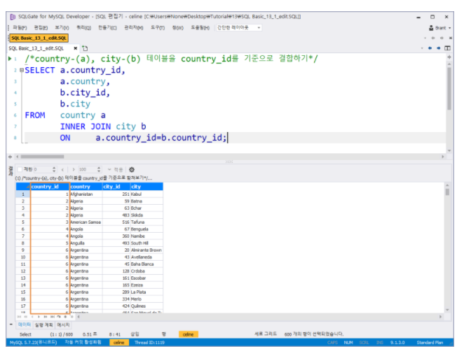
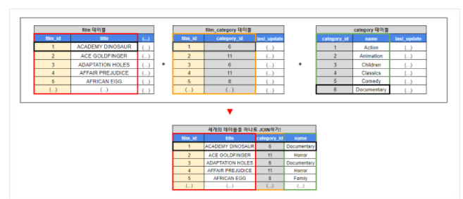
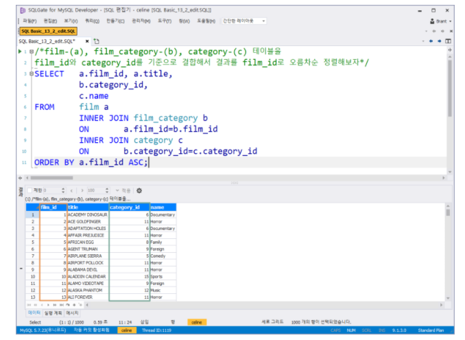
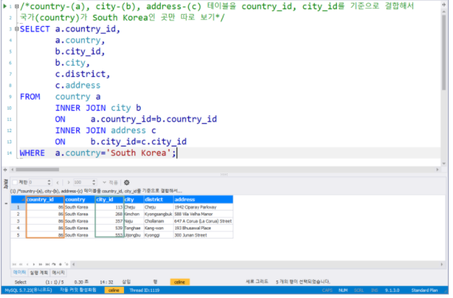
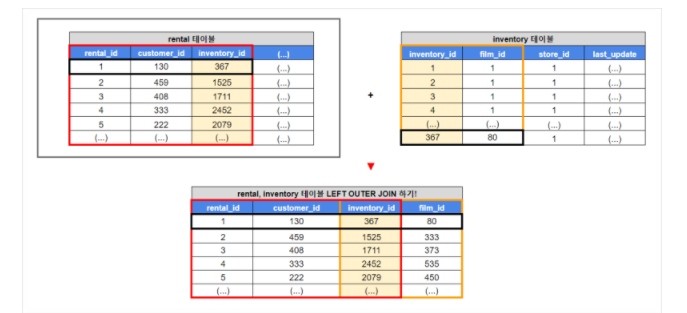
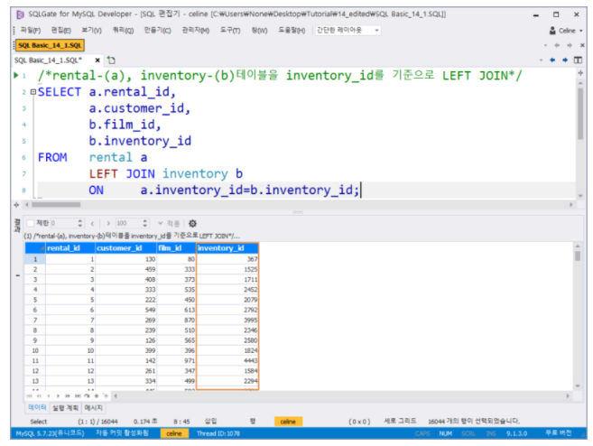
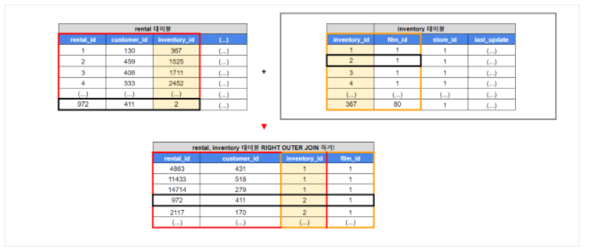
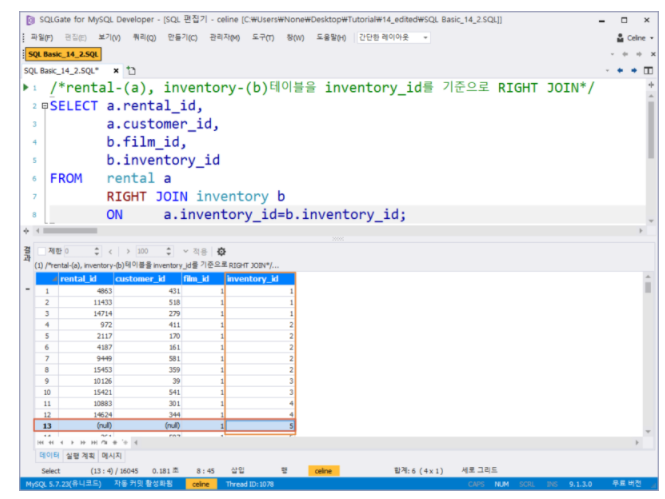
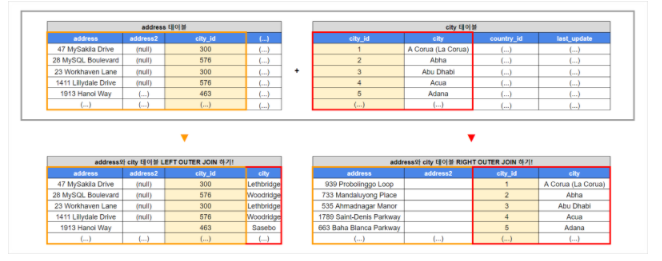

## 2021년10월26일_join의종류

## inner join, outer join

- country 테이블이랑 city 테이블을 country_id를 기준으로 결합
  - country_id, country, city_id, city 컬럼의 데이터를 선택해서 각 국가에 속한 도시명을 한눈에 확인

``` sql
SELECT country.country_id, country.country, city.city_id, city.city 
FROM country
INNER JOIN city 
ON country.country_id=city.country_id;
```


- 공통적 데이터는 country_id
- last_update의 경우 
  - 데이터 유형으로 테이블 내에 있는 각 열에 있는 데이터가 생성되거나 변경된 시간 가리킴
    - 따라서 컬럼명을 가지고 있다고 해서 같은 데이터라고 할 수 없음

### inner  join(내부 결합)

- 공통된 데이터를 기준으로 테이블을 결합하는 것


- country 테이블에서는 국가 번호와 국가명, city 테이블에서는 도시번호와 도시명 가져와서 결합
-  ON 다음에 공통으로 묶어주는 데이터의 테이블과 컬럼명을 명시

```sql
SELECT (컬럼명/복수의 테이블에서 컬럼을 가져올 때는 ‘테이블명 or 테이블 별칭.컬럼명’)

FROM (테이블명 or 테이블 별칭 지정-1)

INNER JOIN (테이블명 or 테이블 별칭 지정-2) ON (테이블1.컬럼명) = (테이블2.컬럼명)
```


## country-a, city-b로 간단하게 별칭 사용해서 만들기

```sql
SELECT a.country_id, a.country, b.city_id, b.city 
FROM country a
INNER JOIN city b 
ON a.country_id=b.country_id;
```




## film, film_category, category 테이블을 film_id와 category_id를 기준으로 결합해서 film_id로 오름차순

- film_id, title, category_id, name 컬럼의 데이터 선택해서, 각 영화에 해당하는 장르를 한 테이블에서 확인

```sql
SELECT a.film_id, a.title, b.category_id, c.name
FROM film a
INNER JOIN film_category b ON a.film_id=b.film_id
INNER JOIN category c ON b.category_id=c.category_id
ORDER BY a.film_id ASC;
```




```sql
SELECT (컬럼명/복수의 테이블에서 컬럼을 가져올 때는 ‘테이블명 or 테이블 별칭.컬럼명’)

FROM (테이블명 or 테이블 별칭 지정-1)

INNER JOIN (테이블명 or 테이블 별칭 지정 -2) ON (테이블1.컬럼명) = (테이블2.컬럼명)

INNER JOIN (테이블명 or 테이블 별칭 지정-3) ON (테이블2.컬럼명) = (테이블3.컬럼명)
```



## inner join 활용 예제

- country, city,  address 테이블은 country_id, city_id 기준으로 결합해서 국가가 south korea인 곳만 

  - country_id, country, city_id, city, distinct, address 컬럼의 데이터를 선택

    - 한국에 해당하는 도시 주소와 지역 확인 하는법

    


- INNER JOIN의 조건을 다 적어준 뒤 WHERE a.country='South Korea'를 추가해주면됨



## 외부 결합 

- LEFT/ RIGHT JOIN


## rental, inventory 테이블을 inventory_id를 기준으로 LEFT JOIN을 활용해서 결합

- rental_id, a.customer_id, b.film_id, b.inventory_id 컬럼의 데이터를 선택
  - 대여 기록 별 손님 번호, 영화 번호, 재고 번호 확인

```sql
SELECT a.rental_id, a.customer_id, b.film_id, b.inventory_id
FROM rental a
LEFT JOIN inventory b ON a.inventory_id=b.inventory_id;
```



``` sql
SELECT (컬럼명/복수의 테이블에서 컬럼을 가져올 때는 ‘테이블명 or 테이블 별칭.컬럼명’)

FROM (테이블명 or 테이블 별칭 지정-1)

LEFT JOIN (테이블명 or 테이블 별칭 지정-2) ON (테이블1.컬럼명) = (테이블2.컬럼명)
```




## rental, inventory 테이블을 inventory_id를 기준으로 RIGHT JOIN을 활용해서 결합

- rental_id, a.customer_id, b.film_id, b.inventory_id 컬럼의 데이터를 선택
  - 재고 목록 별 손님 번호, 영화 번호, 대여 기록 한 눈에 확인

``` sql
SELECT a.rental_id, a.customer_id, b.film_id, b.inventory_id
FROM rental a
RIGHT JOIN inventory b ON a.inventory_id=b.inventory_id;
```



``` sql
SELECT (컬럼명/복수의 테이블에서 컬럼을 가져올 때는 ‘테이블명 or 테이블 별칭.컬럼명’)

FROM (테이블명 or 테이블 별칭 지정-1)

RIGHT JOIN (테이블명 or 테이블 별칭 지정-2) ON (테이블1.컬럼명) = (테이블2.컬럼명)
```



-  LEFT JOIN했을 때는 보이지 않았던 사실이 inventory 테이블을 기준으로 RIGHT JOIN했을 때 보인다는 점

## 내부 결합과 외부 결합

- inner join은 공통된 컬럼의 데이터 기준으로 테이블을 결합 해서 
  - Table A와 Table B에서 결합하려는 컬럼의 데이터가 양쪽에 존재하는 것이 아니라 한쪽에만 존재하는 경우 결과 값에 포함 되지 않음
- outer join 의 Left/ right join은 Table A와 Table B에서 결합하려는 컬럼의 데이터가 일치하지 않은 경우
  - 결과값에 포함되지 않는 것이 아니라 한 쪽의 데이터는 null 값으로 처리되어 나옴
    - 즉, LEFT, RIGHT는 기준이 되는 테이블의 위치를 의미
  - 왼쪽 테이블을 기준으로 할 경우 해당 테이블의 모든 데이터가 결과에 포함되고,
  - 오른쪽 테이블에 일치하는 데이터가 없을 경우 그 데이터 제외하는것 아니고 null로 표시
    - 오른쪽 테이블 기준이라면 위와 반대 임


## 원본

## 참조사이트
[sql join 참고 사이트](https://m.blog.naver.com/PostView.naver?blogId=sqlgate&logNo=221356037051&targetKeyword=&targetRecommendationCode=1)

- film, film_category 테이블의 데이터를 film_id 기준으로 결합한다고 했을 때
- 이전의 inner join의 경우
  - 두 테이블에서 공통적으로 포함되는 데이터인 film_id 3,4,5번을 기준으로 결합하게 됨
-  left join의 경우 
  - 왼쪽 테이블인 film 테이블의 전체 데이터를 기준으로 하므로 film_id 1,2,3,4,5번을 기준으로 결합
- right join의 경우
  - 반대로 오른쪽 테이블인 film_category 테이블의 전체 데이터를 기준으로 하므로 film_id 3,4,5,6,7를 기준으로 결합
  - film 테이블에 없는 6,7번데이터의 경우 title, length가 null값으로 처리

## left/ right join 활용한 예제

- address 테이블과 city 테이블을 city_id 기준으로 결합
  - address, address2, city, city_id 컬럼의 테이터를 선택해서, 도시명과 주소를 한테이블에서 확인

#### left join

```sql
SELECT a.address, a.address2, b.city, b.city_id
    FROM address a
    LEFT JOIN city b ON a.city_id=b.city_id;
```

#### right join

```sql
SELECT a.address, a.address2, b.city, b.city_id
    FROM address a
    RIGHT JOIN city b ON a.city_id=b.city_id
    WHERE address2 IS NULL;
```


