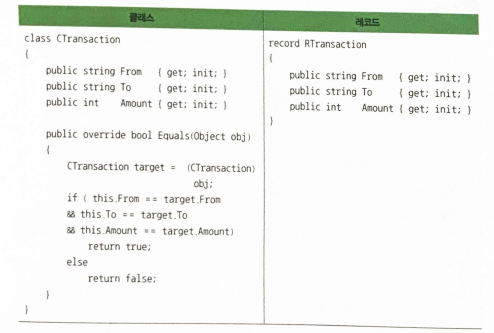
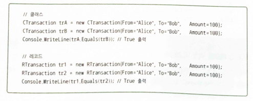

## 22.02.04_Csharp프로퍼티

## 목차

>  1.기본적인  방식
>
> 2.메소드보다 프로퍼티
>
> > 2.1 프로퍼티를 이용한 예제 프로그램
>
> 3.자동구현 프로퍼티
>
> > 3.1 자동프로퍼티로 구현
> >
> >  3.2 자동 구현 프로퍼티 뒤에서 일어나는 일
> > 컴파일러가 자동으로 구현
>
>  4.프로퍼티와 생성자
>
> 5.초기화전용(Init-Only) 자동 구현 프로퍼티
> 에서 오염을 방지하는 여러 장치
>
>  6.레코드 형식으로 만드는 불편 객체
>
> > 6.1 레코드 선언하기
> >
> > 6.2 with를 이용한 레코드 복사
> >
> > 6.3 레코드 객체 비교하기
>
> 7.무명형식
>
>  8.인터페이스의 프로퍼티
>
>  9.추상클래스의 프로퍼티

- 객체지향 언어는 `은닉성`을 표현할 수 있어야 함
  - 객체의 데이터가 의도하지 않게 오염되는 것을 막아야함
  - C++이나 java에서는 private이나 protected 접근 한정자를 이용해서 클래스 내의 필드를 외부에서 보이지 않게 감추고,
    - 이 필드에 접근하는 메소드들은 public으로 따로 제공
  - Csharp도 비슷하게 사용할 수 있지만 프로퍼티라는 것을 이용함

## 1.기본적인  방식

```c#
class MyClass
{
    private int myField;
    public int GetMyField(){return myField};
    public void SetMYField(int NewValue){myField = NewValue}
}

//사용
MyClass obj = new MyClass();
obj.SetMyField(3);
Console.WriteLine(obj.GetMyField());
```

- 컴파일에 문제 없고, 우리가 원하는 대로 은닉성 지키면서 필드를 읽고 씀
  - 자바의 경우 완벽한 정석임ㄴ

## 2. 메소드보다 프로퍼티

- 프로퍼티 사용법

  ```c#
  class 클래스이름
  {
      데이터형식 필드이름;
      접근한정자 데이터형식 프로퍼티이름;
      {
          get
          {
              return 필드이름;
  	  }
          set
          {
              필드이름 = value;
  	  }
      }
  }
  ```

  - 여기서 get과 set을 일컬어 접근자라고 함
    - get은 필드로부터 값을 읽어오고
    - set은 필드에 값을 할당
      - set 접근자안에 있는 value 키워드를 주목하면 우리가 선언안해도 그냥 암묵적으로 매개변수로 간주함

- 이전 소스 프로퍼티로 변경

  ```c#
  class MyClass
  {
      private int myField;
      public int MyField
      {
          get
          {
              return myField;
  	  }	
          set
          {
              myField = value;
          }
      }
  }
  
  //사용
  Myclass obj = new MyClass();
  obj.MyField = 3;
  Console.WriteLine(obj.MyField);
  ```

  

  - set을 구현하지 않게 된다면 그냥 자연스럽게 읽기 전용 프로퍼티가됨

### 2.1 프로퍼티를 이용한 예제 프로그램

```c#
using System;

namespace Property
{
    class BirthdayInfo
    {
        private string name;
        private DateTime birthday;
        
        public string Name;
        {
            get
            {
                return name;
	    }
            set
            {
                name = value;
	    }
    }
        
        public DateTime Birthday
        {
            get
            {
                return birthday;
	    }
            set
            {
                birthday = value;
	    }
	}
        
        public int Age
        {
	    get
            {
                return new DateTime(DateTime.Now.Subtract(birthday).Ticks).Year;
	    }
        }
}
    
    class MainApp
    {
        static void Main(string[] args)
        {
            BirthdayInfo birth = new BirthdayInfo();
            birth.Name = "경민";
            birth.Birthday = new DateTime(1992,08,28);
            
            Console.WriteLine($"Name : {birth.Name}");
            Console.WriteLine($"Birthday : {birth.Birthday.ToShortDateString()}");
            Console.WriteLine($"Age : {birth.Age}");
        }
   }
}
```

## 3.자동구현 프로퍼티

- before

  ```c#
  public class NameCard
  {
      private string name;
      private string phoneNumber;
      
      public string Name
      {
          get{return name;}
          set{name = value;}
      }
      
      public string PhoneNumber
      {
          get{return phoneNumber;}
          set{phoneNumber = value;}
      }
  }
  ```

  - 중복 코드를 작성하고 있다는 기분이 듦
    - 그냥 읽고 쓰기만 하는데 이를 위한 대책으로 자동 프로퍼티 Csharp3.0부터 도입

- after | 자동 프로퍼티 적용

  ```c#
  public class NameCard
  {
      private string name;
      private string phoneNumber;
      
      public string Name
      {
          get; set;
      }
      
      public string PhoneNumber
      {
          get; set;
      }
  }
  ```

- upgrade | Csharp7.0 프로퍼티 선언가 동시에 초기화 수행

  - 프로퍼티 초깃값이 필요할 때 생성자에 초기화 코드를 작성하는 수고 덜음

  ```c#
  public class NameCard
  {
      public string Name{get; set;} = "Unknowmn";
      public string PhoneNumber{get; set;} = "000-0000";
  }
  ```

### 3.1 자동프로퍼티로 구현

```c#
using System;

namespace Property
{
    class BirthdayInfo
    {
        public string Name{get; set;} = "Unknown";
        public DateTime Birthday {get; set;} = new DateTime(1,1,1,);
        public int Age
        {
	    get
            {
                return new DateTime(DateTime.Now.Subtract(birthday).Ticks).Year;
	    }
        }
    }
    
    class MainApp
    {
        static void Main(string[] args)
        {
            BirthdayInfo birth = new BirthdayInfo();
            Console.WriteLine($"Name : {birth.Name}");
            Console.WriteLine($"Birthday : {birth.Birthday.ToShortDateString()}");
            Console.WriteLine($"Age : {birth.Age}");
            
            birth.Name = "경민";
            birth.Birthday = new DateTime(1992,08,28);
            
            Console.WriteLine($"Name : {birth.Name}");
            Console.WriteLine($"Birthday : {birth.Birthday.ToShortDateString()}");
            Console.WriteLine($"Age : {birth.Age}");
        }
   }
}
```

### 3.2 자동 구현 프로퍼티 뒤에서 일어나는 일

- <Birthday>k_BackingField와 <Name>k_BackingField라는 우리가 선언하지 않은게 생김
  - 이것은 Csharp컴파일러가 자동으로 구현
  - <Birthday>k_BackingField는 Birthday프로퍼티를 위해
  - <Name>k_BackingField는 Name프로퍼티를 위해 컴파일러가 물밑에서 선언해준 것

## 4.프로퍼티와 생성자

- 프로퍼티를 이용한 초기화하는 형식

  ```c#
  클래스이름 인스턴스 = new 클래스이름()
  {
      프로퍼티1 = 값,
      프로퍼티2 = 값,
      프로퍼티3 = 값
  };
  ```

  - 그렇다고 초기화 필요없는 프로퍼티까지 넣을 필요없이 선택하면됨

- **BirthdayInfo  클래스로 예를 든 프로퍼티를 이용한 객체 생성 후 초기화**

  ```c#
  BirthdayInfo birth = new BirthdayInfo()
  {
      Name = "경민",
      Birthday = new DateTime(1992,08,17)
  }
  ```

- 예제 프로그램 만들기

  ```c#
  using System;
  
  namespace ConstructorWithProperty
  {
      class BirthdayInfo
      {
          public string Name
          {
              get; 
              set;
          }
          public DateTime Birthday 
          {
              get; 
              set;
          }
          public int Age
          {
  	      get
              {
                  return new DateTime(DateTime.Now.Subtract(birthday).Ticks).Year;
  	      }
          }
     }
      
      class MainApp
      {
          static void Main(string[] args)
          {
              BirthdayInfo birth = new BirthdayInfo()
              {
                  Name = "경민",
                  Birthday = new DateTime(1992,08,17)		}
              
              Console.WriteLine($"Name : {birth.Name}");
              Console.WriteLine($"Birthday : {birth.Birthday.ToShortDateString()}");
              Console.WriteLine($"Age : {birth.Age}");
          }
     }
  }
  ```

## 5.초기화전용(Init-Only) 자동 구현 프로퍼티

- Csharp에서 오염을 방지하는 여러 장치

  - 접근한정자
  - readonly 필드
  - readonly 구조체
  - 튜플

- 프로퍼티를 읽기 전용으로 선언하는 방법이 조금 불편했음

  - 아래와 같이 생성자를 통해 필드를 초기화
  - 그 필드에 접근하는 프로퍼티는 get 접근자만 갖도록 해야했음

  ```c#
  class Transaction
  {
      public Transaction(string _from, string _to, int _amount)
      {
          from = _from; to = _to; amount = _amount;
      }
      
      string from;
      string to;
      int amount;
      
      public string From {get{return from;}}
      public string To {get{return to;}}
      public int Amount {get{return amount;}}
  }
  ```

  - Csharp9.0 에서는 읽기 전용 프로퍼티를 아주 간편하게 선언할 수 있도록 개선됨

    - init접근자가 새로 도입됨

  - init접근자

    - set 접근자처럼 외부에서 프로퍼티를 변경할 수 있지만,

    -  객체 초기화를 할 때만 프로퍼티 변경이 가능하다는 점이 다름

    - 사용법

      ```c#
      public class Transaction
      {
          public string From {get; init;}
          public string To {get; init;}
          public string Amount {get; init;}
      }
      ```

      - 위처럼 자동프로퍼티를 선언하면서 set 접근자 대신 init접근자를 명시하면 됨
        - 이렇게 선언된것을 `초기화 전용 자동 구현` 프로퍼티라고 함

- **돈거래 관련 초기화 전용 프로퍼티 사용**

  ```c#
  using System;
  
  namespace InitOnly
  {
      class Transaction
      {
          public string From {get; init;}
          public string To {get; init;}
          public int Amount {get; init;}
          
          public override string ToString()
          {
              return $"{From,-10} -> {To,-10} : ${Amount}";
  	  }
      }
      
      class MainApp
      {
          static void Main(string[] args)
          {
              Transaction tr1 = new Transaction{From="Alice", To="Bob", Amount=100};
              Transaction tr2 = new Transaction{From="Bob", To="Charlie", Amount=50};
              Transaction tr3 = new Transaction{From="Charlie",To="Alice", Amount=50};
              
              Console.WriteLine(tr1);
              Console.WriteLine(tr2);
              Console.WriteLint(tr3);
  	  }
      }
  }
  ```

  - init 접근자는 초기화 이후에 발생하는 프로퍼티 수정을 허용하지 않음

## 6.레코드 형식으로 만드는 불편 객체

- 불변 객체란?
  - 내부상태(데이터)를 변경할 수 없는 객체
  - 그래서, 데이터 복사와 비교가 많이 이루어짐
  - 새로운 상태를 표현하려고 기존 상태를 복사한뒤 
    - 이 중 일부를 수정해서 새로운 객체를 만들고, 
    - 상태를 확인하기 위해 객체 내용을 자주 비교함

- 값 형식 객체는 다른 객체에 할당할 때, 깊은 복사를 수행

  - 깊은 복사란?

    ```markdown
    - 모든 필드를 새 객체가 가진 필드에 1 : 1로 복사하는 것을 말함
    - 배열의 요소에 입력하거나 함수 인수로 사용할 때도 늘 깊은 복사를 함
    ```

    - 단, 필드가 많으면 많을수록 복사 비용은 커짐
    - 객체를 여러 곳에서 사용해야하는 경우엔 더 커짐
      - 참조형식은 이런 오버헤드가 없음
        - 객체가 참조하는 메모리 주소만 복사하면 되기 때문
        - 단점은 프로그래머가 직접 깊은 복사를 구현해야함
          - 보통 object로 부터 상속하는 Equals() 메소드를 오버라이딩함

- 레코드 형식은 값형식 처럼 다룰 수 있는 불변 참조 형식으로, 
  - 참조형식의 비용 효율과 값 형식이 주는 편리함을 모두 제공

### 6.1 레코드 선언하기

```c#
record RTransaction
{
    public string From {get; init;}
    public string To {get; init;}
    public string Amount {get; init;}
}

//사용
RTransaction tr1 = new RTransaction{From = "Alice", To = "Bob", Amount =100};
RTransaction tr2 = new RTransaction{From = "Bob", To = "Charlie", Amount =300};
```

- 레코드라고 인스턴스를 만들면 불변 객체가 만들어짐
  - 레코드에는 초기화 전용 자동 구현 프로퍼티뿐만 아니라 쓰기 가능한 프로퍼티와 필드도 자유롭게 선언가능

- **레코드 예제 프로그램**

  ```c#
  using System;
  
  namespace Record
  {
      record RTransaction
      {
          public string From {get; init;}
          public string To {get; init;}
          public string Amount {get; init;}
          
          public override string ToString()
          {
              return $"{From,-10} -> {To,-10} : ${Amount}";
  	  }
      }
      
      class MainApp
      {
          static void Main(string[] args)
          {
              RTransaction tr1 = new RTransaction
              {
                From = "Alice", To = "Bob", Amount = 100
              };
              
              RTransaction tr2 = new RTransaction
              {
                 From = "Bob", To = "Charlie", Amount = 100
  	      };
              
              Console.WriteLine(tr1);
              Console.WriteLine(tr2);
  	  }
      }
  }
  ```

### 6.2 with를 이용한 레코드 복사

- Csharp 컴파일러는 레코드 형식을 위한 복사 생성자를 자동으로 작성

  - 단, protected로 선언되어 있어 명시적 호출 안됨
  - with 식을 이용해야함

  ```c#
  RTransaction tr1 = new RTransaction(From = "Alice", To = "Bob", Amount = 100);
  RTransaction tr2 = with tr1 {To="Charlie"};
  // tr1의 모든 상태를 복사하고 To 프로퍼티 값만 Charlie로 수정
  ```

### 6.3 레코드 객체 비교하기

- 컴파일러는 레코드의 상태를 비교하는 Equals() 메소드를 자동으로 구현 

  - 다음 표에서 왼쪽에는 클래스 객체 상태 비교를 위한 Equals() 메소드 오버라이딩 예제
  - 왼쪽은 평범한 레코드 선언 예제

  




## 7.무명형식

- 형식의 선언과 동시에 인스턴스를 할당 

  - 이 때문에 인스턴스를 만들고 다시는 사용하지 않을 때 요긴함

- 선언

  ```c#
  var myInstance = new {Name="kmp", Age="25"};
  ```

- 주의 할 점

  - 무명 형식의 프로퍼티에 할당된 값은 변경 불가능
  - 즉, 읽기만 가능함

## 8.인터페이스의 프로퍼티

- 인터페이스는 메소드뿐만 아니라 프로퍼티와 인덱서도 가질 수 있음

```c#
interface 인터페이스이름
{
    public 형식 프로퍼티이름1
    {
        get; set;
	}
    
    public 형식 프로퍼티이름2
    {
        get; set;
    }
    //...
}
```

- **프로퍼티를 가진 인터페이스와 이를 상속하는 파생 클래스의 예**

```c#
inteface IProduct
{
    string ProductName
    {
        get; set;
	}
}

class Product : IProduct
{
    private string productName;
    
    public string ProductName //파생클래스는 기반 인터페이스에 선언된 모든 프로퍼티를 구현
    {
        get{return productName;}
        set{productName = value;}
    }
}
```

## 9.추상클래스의 프로퍼티

- 추상클래스에서는 추상 프로퍼티라고 함

```c#
abstract class 추상 클래스이름
{
    abstract 데이터형식 프로퍼티이름
    {
        get;
        set;
    }
}
```

- **추상프로퍼티를 갖는 추상 클래스와 이를 상속하는 파생 클래스의 예제 코드**

  ```c#
  abstract class Product
  {
      private static int serial = 0;
      public string SerialID
      {
          get{return String.Format("(0:d5)",serial++)}
      }
      abstract public DateTime productDate
      {
          get;
          set;
      }
  }
  
  class MyProduct : Product
  {
      public override DateTime ProductDate
      {
          get;
          set;
      }
  }
  ```

  
