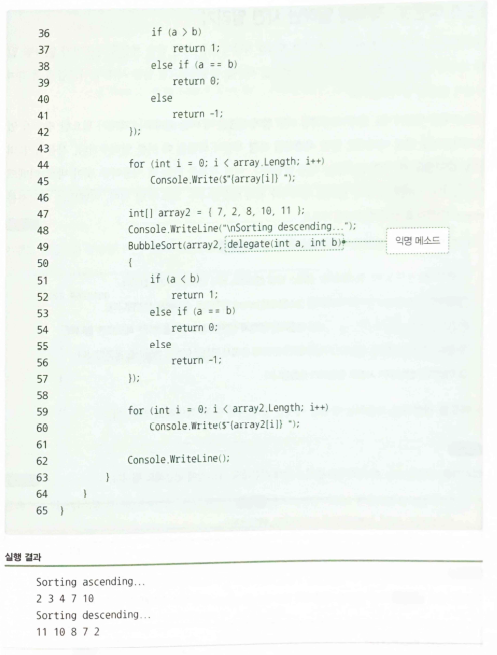
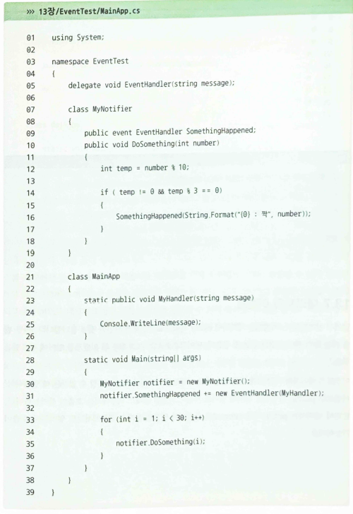
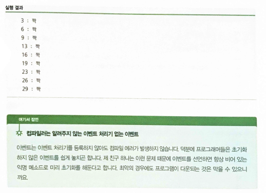

## 22.02.06_Csharp대리자와이벤트

## 목차

> 1.대리자란?
>
> 2.대리자는 왜, 그리고 언제 사용하나?
>
> 3.일반화 대리자
>
> 4.대리자 체인
>
> 5.익명 메소드
>
> 6.이벤트: 객체에 일어난 사건 알리기
>
> 7.대리자와 이벤트

- 컴퓨터에 발생하는 이벤트에 반응하도록 프로그램을 만드는 것을 일컬어 이벤트 기반 프로그래밍이라고 함
  - 이벤트 기반 프로그래밍은 GUI를 만들때 특히 유용
  - 이벤트기반 프로그래밍을 이해하려면 먼저  `대리자`를 알아야함
  - 그 다음에는 이벤트를 알아야함 

## 1.대리자란?


- 상현이가 비서에게 했던 부탁을 영어로 콜백이라고 함
  - 어떤일을 수행하는 코드, 즉 콜백을 작성하고 다른 코드에 이 콜백을 맡겨 대신 실행하게 함
  - 여기서 콜백을 맡아줄 코드는 컴파일 시점이 아닌 프로그램 실해 중에 결정됨
    - 콜백을 맡아 실행하는 일은 `대리자`가 담당
- 대리자는 메소드에 대한 참조임
  - 대리자에 메소드의 주소를 할당한 후 대리자를 호출하면 이 대리자가 메소드를 호출해줌

```csharp
한정자 delegate 반환_형식 대리자_이름(매개변수_목록);

//사용
delegate int MyDelegate(int a, int b);
```

- 대리자는 메소드에 대한 참조이기 때문에 자신이 참조할 메소드의 반환 형식과 매개변수를 명시해줘야함

- 여기서 중요한것은 대리자는 인스턴스가 아닌 형식임
  - MyDelegate는  int, string과 같은 형식이며,
  - 메소드를 참조하는 그 무엇을 만들려면 MyDelegate의 인스턴스를 따로 만들어야함

- **대리자가 참조할 메소드를 선언**

  ```csharp
  int Plus (int a, int b)
  {
      return a+b;
  }
  int Minus (int a, int b)
  {
      return a-b;
  }
  
  //MyDelegate가 참조하도록 하는것
  MyDelegate Callback;
  
  Callback = new MyDelegate(Plus);
  Console.WriteLine(Callback(3,4));//7출력
  
  Callback = new MyDelegate(Minus);
  Console.WriteLine(Callback(7,5));
  ```

  

- 대리자를 이용하여 콜백을 구현하는 과정
  - 1.대리자를 선언한다.
  - 2.대리자의 인스턴스를 생성한다. 인스턴스를 생성할 때는 대리자가 참조할 메소드를 인수로 넘긴다.
  - 3.대리자를 호출한다.
- 그리고 정적 메소드 역시 참조할 수 있음

## 2.대리자는 왜, 그리고 언제 사용하나?

- 프로그래밍을 하다 보면 값이 아닌 코드 자체를 매개변수에 넘기고 싶을때가 많음

- **Step1**

  - Compare 대리자를 선언

  ```csharp
  delegate int Compare(int a, int b);
  ```

- **Step2**

  - Compare 대리자가 참조할 비교 메소드를 작성

  ```csharp
  static int AscendCompare(int a, int b)
  {
      if(a>b)
          return 1;
      else if(a==b)
          retrun 0;
      else 
          return -1;
  }
  ```

- **Step3**

  - 정렬 메소드 작성
    - 이때 매게변수로는 정렬할 배열과 비교할 메소드를 참조하는 대리자를 입력받음

  ```csharp
  static void BubbleSort(int []DataSet, Compare Comparer)
  {
      int i = 0;
      int j = 0;
      int temp = 0;
      for(i=0;i<DataSet.Length-1; i++)
      {
          for(j=0;j<DataSet.Length-(i-1); j++)
          {
              if(Compare(DataSet[j], DataSet[j+1])>0)
              {
                  temp = DataSet[j+1];
                  DataSet[j+1] = DataSet[j];
                  DataSet[j] = temp;
              }
  		}
      }
  }
  ```

  - 이렇게 하면 어떤 메소드를 참조하고 있는가에 따라 정렬 결과가 달라짐

- **Step4**

  ```csharp
  int[] array = {3,7,4,2,10};
  BubbleSort(array, new Compare(AscendCompare));
  ```

## 3.일반화 대리자

- 일반화 메소드 대리자 선언

  ```csharp
  delegate int Compare<T>(T a, T b);
  
  //보통 메소드
  static void BubbleSort(int []DataSet, Compare Comparer)
  ...
  //일반화 메소드
  static void BubbleSort<T>(T []DataSet, Compare<T> Comparer)
  ...
      
  static int AscendCompare<T>(T a, T b) where T : IComparable<T>
  {
     return a.CompareTo(b);
  }
  ```

## 4.대리자 체인

- 대리자 하나가 여러 개의 메소드를 동시에 참조할 수 있음

  ```csharp
  delegate void ThereIsAFire(string location);
  
  void Call119(stirng location)
  {
      Console.WriteLine($"소방서죠? 불났어요! 주소는 {location}");
  }
  
  void ShotOut(string location)
  {
      Console.WriteLine($"피하세요! {location}에 불이 났어요!")
  }
  
  void Escape(string location)
  {
      Console.WtireLine($"{location}에서 나갑시다!");
  }
  ```

- 이렇게 선언한 메소드들은 ThereIsAFire대리자의 인스턴스가 자신들을 동시에 참조할 수 있도록 +=로 결합 할수 있음

  ```csharp
  ThereIsAFire Fire = new ThereIsAFire(Call119);
  Fire += new ThereIsAFire(ShotOut);
  Fire += new ThereIsAFire(Escape);
  
  Fire("우리집");
  ```

  - 이렇게 결합해놓으면 한 번 호출하면 자신이 참조하고 있는 모든 메소들 호출함

- 대리자 체인 만드는 방식

  ```csharp
  // + 연산자와 = 연산자 사용하기
  ThereIsAFire Fire = new ThereIsAFire (Cal1119 )
  + new ThereIsAFire ( Shoutout )
  + new ThereIsAFire ( Escape );
  // Delegate.Combine() 메소드 사용하기
  ThereIsAFire Fire = (ThereIsAFire) Delegate.Combine(
  new ThereIsAFire ( Call119),
  new ThereIsAFire ( Shoutout ),
  new ThereIsAFire ( Escape ) );
  ```

  - 대리자 체인 끊는법
    - -= 또는 -, = 그리고  Delegate.Remove()하면됨

## 5.익명 메소드

- 이름이 없는 메소드

```csharp
delegate int Calculate(int a, int b);

public static void Main()
{
    Calculate Calc;
    
    Calc = delegate(int a, int b)
    		{
        		return a+b;
    		}
    Console.WriteLine("3+4 : {Calc(3,4)}");
}
```

- 위와 같이 익명의 메소드의 선언 형식은

  ```c#
  대리자_인스턴스 = delegate(매개변수_목록)
  				{
      				//실행하고자 하는 코드
  				}
  ```

  - 대리자가 참조할 메소드를 넘겨야 할 일이 있는데, 이 메소드가 두 번 다시 사용할 일이 없다고 판단되면 그때가 익명 메소드를 사용할 타이밍임




## 6.이벤트: 객체에 일어난 사건 알리기

- 이벤트의 동작 원리는 대리자와 거의 비슷

- 이벤트는 대리자를 event 한정자로 수식해서 만듦

- **이벤트를 선언하고 사용하는 절차**

- **Step1**

  1.대리자를 선언(대리자는 클래스 밖에 선언해도되고, 안에 선언해도됨)

  ```csharp
  delegate void EventHandler(string message);
  ```

- **Step2**

  2.클래스 내에  1.에서 선언한 대리자의 인스턴스를 event 한정자로 수식해서 선언

  ```csharp
  class MyNotifier
  {
      public event EventHandler SomethingHappened;
    	
      public void DoSomething(int number)
      {
          int temp = number % 10;
          
          if(temp != 0 && temp % 3 == 0)
          {
              SomethingHappened(String.Format($"{number} : 짝"));
  		}
  	}
  }
  ```

- **Step3**

  3.이벤트 핸들러를 작성, 이벤트 핸들러는 1.에서 선언한 대리자와 일치하는 메소드면 됨

  ```csharp
  class MainApp
  {
      static public void MyHandler(string message)
      {
          Console.WriteLine(message);
  	}
      //...
  }
  ```

- **Step4**

  4.클래스의 인스턴스를 생성하고 이 객체의 이벤트에 3.에서 작성한 이벤트 핸들러를 등록

  ```csharp
  class MainApp
  {
      static public void MyHandler(string message)
      {
          Console.WriteLine(message);
  	}
      
      static void Main(string[] args)
      {
       	MyNotifier notifier = new MyNotifier();
          notifier.SomethingHappened += new EventHandler(MyHandler);
          
          for(int i=1; i<30; i++)
          {
              notifier.DoSomthing(i);
  		}
  	}
  }
  ```

- **Step5**

  5.이벤트가 발생하면 이벤트 핸들러가 호출됨

  ```csharp
  class MainApp
  {
  	static public void MyHandler(string message)
  	{
  		Console.WriteLine(message);
  	}
      
  	static void Main(string[] args)
  	{
  		MyNotifier notifier = new MyNotifier();
  		notifier SomethingHappened += MyHandler;
  		for (int i = 1; i < 30; i++)
  		{
  			notifier.DoSomething(i);
              
          }   
      }
  }
  ```

  



## 7.대리자와 이벤트

- 이벤트와 대리자의 차이가 대리자에 event 키워드로 수식해서 선언한것에 불가한데 무슨 차이가 있을까?
  - 이벤트가 대리자와 가장 다른 점은 바로 이벤트를 외부에서 직접 사용할 수 없다는 데 있음
    - public으로 선언되어 있어도 자신이 선언된 클래스 외부에서는 호출이 불가

- 따라서 대리자는 대리자대로 콜백용도로 사용하고,
- 이벤트는 이벤트대로 객체의 상태 변화나 사건의 발생을알리는 용도로 구분해서 사용해야함