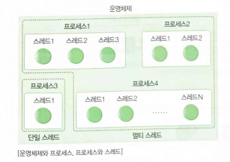
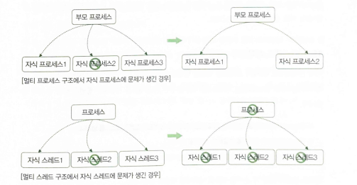
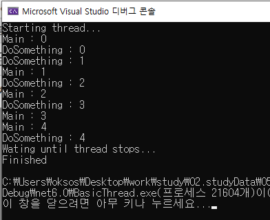

## 22.02.17_스레드와태스크

## 1.프로세스와 스레드

- 오늘날 OS는 여러 프로세스를 동시에 실행할 수 있는 능력 있음
- 덕분에 여러가지 음악도 듣고, 코딩도 할 수 있음
- OS만 동시에 여러 작업을 할 수 있는 것 아님
- 프로세스도 한번에 여러 작업을 할 수 있음
- **프로세스란?**
  - 실행 파일이 실행되어 메모리에 적재된 인스턴스임
  - 가령 word.exe가 실행파일이라면, 이 실행 파일에 담겨 있는 데이터와 코드가 
    - 메모리에 적재되어 동작하는 것이 프로세스
- 프로세스는 반드시 하나 이상의 스레드로 구성되는데,
  - 스레드는 운영체제가 CPU시간을 할당하는 기본단위임
- 프로세스가 밧줄이라면, 스레드는 밧줄을 이루는 실이라고 할 수 있음



### 1.1 멀티 스레드를 이용할 때 장단점

- **장점**

  - 사용자 대화형 프로그램에서(콜솔프로그램과 GUI프로그램 모두) 멀티 스레드를 이용하면 
    - 응답성을 높일 수 있다는 점을 꼽을 수 있음
    - 예를들어 단일 스레드를 사용하는 프로그램을 만들었고, 파일 복사만 30분 걸린다면?
      - 강제로 프로세스를 종료하지 않는 이상 취소도 안됨
      - 이때, 프로그램에 사용자와의 대화를 위한 스레드를 하나 더 추가한다면 파일 복사도 하고 사용자로부터 명령을 입력받을 수 있음
  - 멀티 프로세스 방식에 비해 멀티 스레드 방식이 자원 공유가 쉽다는 것
    - 멀티프로세스는 GUI가 없는 웹 서버 같은 서버용 앱에서 많이 취하는 구조
    - 프로세스끼리 데이터를 교환하려면 소켓이나 공유 메모리 같은 IPC(Inter Process Communication)을 이용해야 함
    - 반면, 멀티 스레드 방식에서는 그저 스레드끼리 코드 내의 변수를 같이 사용하는것만으로도 데이터 교환을 할 수 있음

  

  

  - 멀티 프로세스 방식에 비해 멀티 스레드 방식이 좋은 점이 또하나는 경제성
    - 프로세스를 띄우기 위해 메모리와 자원을 할당하는 작업은(CPU사용시간 등의) 비용이 비쌈
      - 스레드를 띄울 때는 이미 프로세스에 할당된 메모리와 자원을 그대로 사용하므로 메모리와 자원을 할당하는 비용을 지불하지 않아도 됨
  - `응답성을 높일 수 있음` `자원공유가 쉽다` `경제적이다`

- **단점**

  - 멀티 스레드 구조의 SW는 구현하기가 매우 까다로움

  - 테스트 역시 쉽지 않은데다 멀티 스레드 기반의 SW 디버깅은 개발자가 분노를 하게됨

  - 멀티 프로세스 기반의 SW는 여러 개의 자식 프로세스 중 하나에 문제가 생기면 

    - 그 자식 프로세스 하나가 죽는 것 이상으로는 영향이 확산되지 않지만,
    - 멀티스레드 기반의 SW에서는 자식 스레드 중 하나에 문제가 생기면 전체 프로세스에 영향을 줌

    

    - 그리고 장점으로 말했던 성능이 아이러니하게도 스레드를 너무 많이 사용하면 오히려 성능이 더 저하됨

  - `구현이 복잡` `SW안정성을 약화시킬수 있음` `과용하면 성능이 저하될 수 있음`

### 1.2 스레드 시작하기

- .NET은 스레드를 제어하는 클래스로 System.Threading.Thread 를 제공
- 클래스를 사용하는 방법
  - Thread의 인스턴스를 생성, 이때 생성자의 인수로 스레드가 실행할 메소드를 넘김
  - Thread.Start() 메소드를 호출하여 스레드를 시작
  - Thread.Join() 메소드를 호출하여 스레드가 끝날 때까지 기다림

```csharp
static void DoSomething()
{
    for(int i = 0 ; i < 5 ;i++)
    {
        Console.WriteLine($"DoSomething : {i}");
    }
}

static void Main(string[] args)
{
    Thread t1 = new Thread(new ThreadStart(DoSomething));
    t1.Start();
    t1.Join();
}
```

- 이 코드에서 실제 스레드가 메모리에 적재되는 시점은
  - t1.Start() 메소드를 호출했을 때임
    - Thread클래스의 인스턴스는 준비만 함
  - t1.Start()메소드가 호출되고 나면, CLR은 스레드를 실제로 생성 하여 DoSomething()메소드를 호출
  - t1.Join()메소드는 블록되어 있다가 DoSomething() 메소드의 실행이 끝나면, 
    - 다시말해 t1스레드의 실행이 끝나면 반환되어 다음코드를 실행할 수 있게 함
- 아래그림에서처럼 스레드를 하나 실행하면 밧줄에서 실이 한 갈래 빠져 나왔다가 Join() 메소드가 반환되는 시점에서 이 실(스레드)이 다시 밧줄(프로세스)로 `합류`한다고 생각하면됨


### 1.3 실습

```csharp
using System;
using System.Threading;

namespace BasicThread;

class MainApp
{
    static void DoSomething()
    {
        for(int i = 0;i<5;i++)
        {
            Console.WriteLine($"DoSomething : {i}");
            Thread.Sleep(10); 
        }
    }

    static void Main(string[] args)
    {
        Thread t1 = new Thread(new ThreadStart(DoSomething));

        Console.WriteLine("Starting thread...");
        t1.Start();

        for (int i = 0; i < 5; i++)
        {
            Console.WriteLine($"Main : {i}");
            Thread.Sleep(10);
        }

        Console.WriteLine("Wating until thread stops...");
        t1.Join();

        Console.WriteLine("Finished");
    }
}
```

