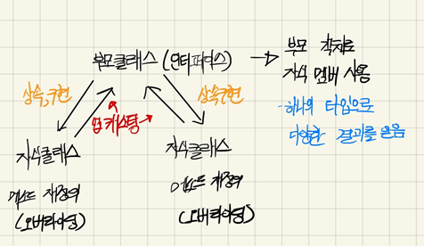
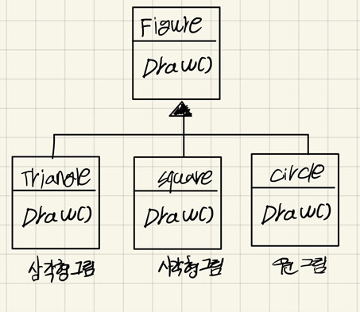

## 다형성이란?
- 같은 자료형에 여러 가지 객체를 대입하여 다양한 결과를 얻어내는 성질을 의미
- 프로그램 언어 각 요소들 (상수, 변수, 식, 객체, 메소드 등)이 다양한 자료형에 속하는 것이 허가되는 성질을 가리킴




### 다형성의 반대말인 단형성이란?

- 다형성의 반대이며, 프로그램 언어의 각 요소가 한 가지 형태만 가지는 성질을 말함

### 다형성 구현 형태
- 클래스의 상속이나 인터페이스를 구현하는 자식 클래스에서 매서드를 재정의(오버라이딩) 하고 자식 클래스를 부모타입으로 업스캐팅(레퍼런스 형변환)함

- 그리고 부모타입의 객체에서 자식 멤버를 참조하여 다형성을 구현

- 다형성을 구현하는 대표적인 
  - 오버로딩, 오버라이딩, 함수형 인터페이스
  
	- 오버로딩
  
    - 함수의 이름은 같고 매개변수가 다른 여러개의 메소드
  
      ```csharp
      public int add(int num1, int num2)
      {
          return num1 + num2;
      }
      
      public double add(double num1, double num2)
      {
          return num1 + num2;
      }
      ```
  
  - 오버라이딩
    - 상위 클래스의 메서드를 하위 클래스에서 재정의 하는 것 즉, 상속
    
      ```csharp
      public class Cake
      {
          public virtual void Cream()
          {
              Console.WriteLine("생크림");
          }
      }
      
      public class CheeseCake : Cake
      {
          public override void Cream()
          {
              Console.WriteLine("치즈크림");
          }
      }
      ```
    
  - 함수형 인터페이스
    - 람다식을 사용하기 위한 API로 자바에서 제공하는 인터페이스에 구현할 메소드가 하나 뿐인 인터페이스를 의미함
    - 함수형 인터페이스는 enum과 함께 사용한다면 다형성의 장점을 경험 할 수 있음
    
      ```c#
      
      public enum Operator {
          PLUS("+", (a, b) -> a + b),
          MINUS("-", (a, b) -> a - b),
          MULTIPLY("*", (a, b) -> a * b),
          DIVIDE("/", (a, b) -> a / b);
      
          private final String sign;
          private final BiFunction<Long, Long, Long> bi;
      
          Operator(String sign, BiFunction<Long, Long, Long> bi) {
              this.sign = sign;
              this.bi = bi;
          }
      
      	  public static long calculate(long a, long b, String sign) {
          	  Operator operator = Arrays.stream(values())
                  	.filter(v -> v.sign.equals(sign))
                  	.findFirst()
                  	.orElseThrow(IllegalArgumentException::new);
      
          	  return operator.bi.apply(a, b);
      	  }
      }
      ```
    
      - [참고자료](https://tecoble.techcourse.co.kr/post/2020-10-27-polymorphism/)
    
      
