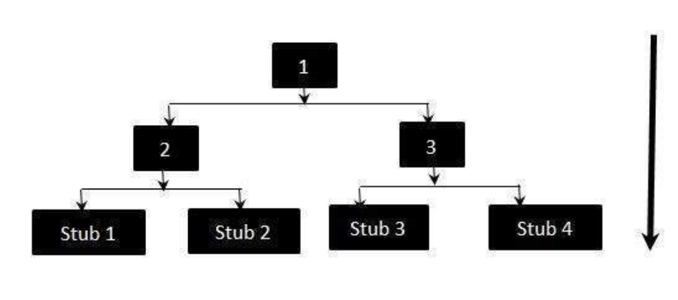
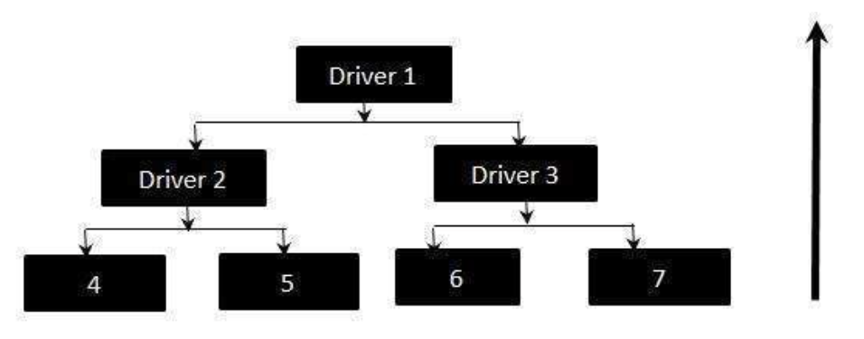

## 22.03.03_Integration테스트

## 목차

> 01.통합테스트란?
>
> 02.통합테스트를 하는 이유
>
> 03.통합테스트 방식
>
> 04.통합테스트 유형
>
> > 하향식(Top-Down)
> >
> > 상향식(Botton-Up)

## 01.통합테스트란?

- 통합테스트는 모듈의 통합하는 단계에서 수행하는 테스트
  - 단위 테스트를 우선 수행하여 모듈들이 각각 정상적으로 작동이 되는 것을 확인했다면
  - 이 모듈들을 연동하여 테스트를 수행하게 되는데 이것을 통합테스트라고 함

## 02. 통합테스트를 하는 이유

- 단위 테스트에서 찾지 못하는 연동시 발생하는 버그등을 찾을 수 있음

## 03.통합테스트 방식

- 다른 모듈들과 동시 다발적으로 테스트를 수행해야 하기 때문에 단위 테스트와 다르게 일반적으로 테스트를 교육 받은 전문적인 테스터와 함께 수행하게됨

- 테스트 시 컴포넌트간의 I/F(인터페이스)를 테스트 하는 것은 물론이고,
  - 운영체제, 파일 시스템, 하드웨어, 시스템간 인터페이스와 같은 시스템의 각기 다른 부분과 상호 연동하는 동작을 테스트 하게 됨

## 04. 통합테스트 유형

### 하향식 (Top-Down)

- 가장 상부의 모듈부터 통합하며 테스트를 순차적으로 진행하는 방식

  - 방식
    - 하향식 테스트를 위해 테스트 스텁(Test Stub)으로 I/F테스트 진행

  - 진행
    - 결함 격리가 쉬우며, 설계상의 결함을 빨리 발견할 수 있음
    - 수정이 어려운 중요한 결함을 하부 구조에서 발견 될 수 있음

### 상향식 (Botton-Up)

- 최하위 모듈을 통합 후, 상부의 모듈을 순차적으로 추가 테스트
  - 방식
    - 상향식 테스트를 위해 테스트 드라이버로 I/F테스트 진행
  - 진행
    - 결함 격리가 쉬우며, 하위 모듈을 충분히 테스트 수행
    - 수정이 어려운 중요한 결함(설계상 결함)을 상부 구조에서 발견 될 수 있음

