## 22.02.28_인터페이스와추상클래스

## 1.인터페이스 선언

- 클래스와 비슷해 보이지만 
  - 메소드, 이벤트, 인덱서, 프로퍼티만을 가질 수 있다는 차이가 있음

- 실제 선언

- 인터페이스는 접근 제한 한정자를 사용할 수 없음
  - 모든 것이 public으로 선언됨
  - 인스턴스 생성도 안됨
- 인터페이스를 상속하는 자식클래스(파생 클래스)는 인터페이스에 선언된 것 모두 선언해야함

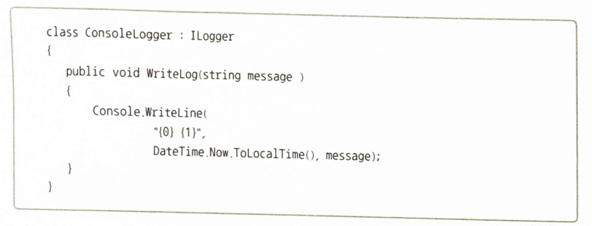

### 1.1 인터페이스 작명법

- Csharp에서는 인터페이스 이름은 대문자(I) 아이를 붙이는 겉이 관례임

### 1.2 인터페이스는 약속이다.

- 즉, 클래스가 따라야 하는 약속
  - 이 약속은 인터페이스로 부터 파생될 클래스가 어떤 메소들르 구현해야 할지를 정의함

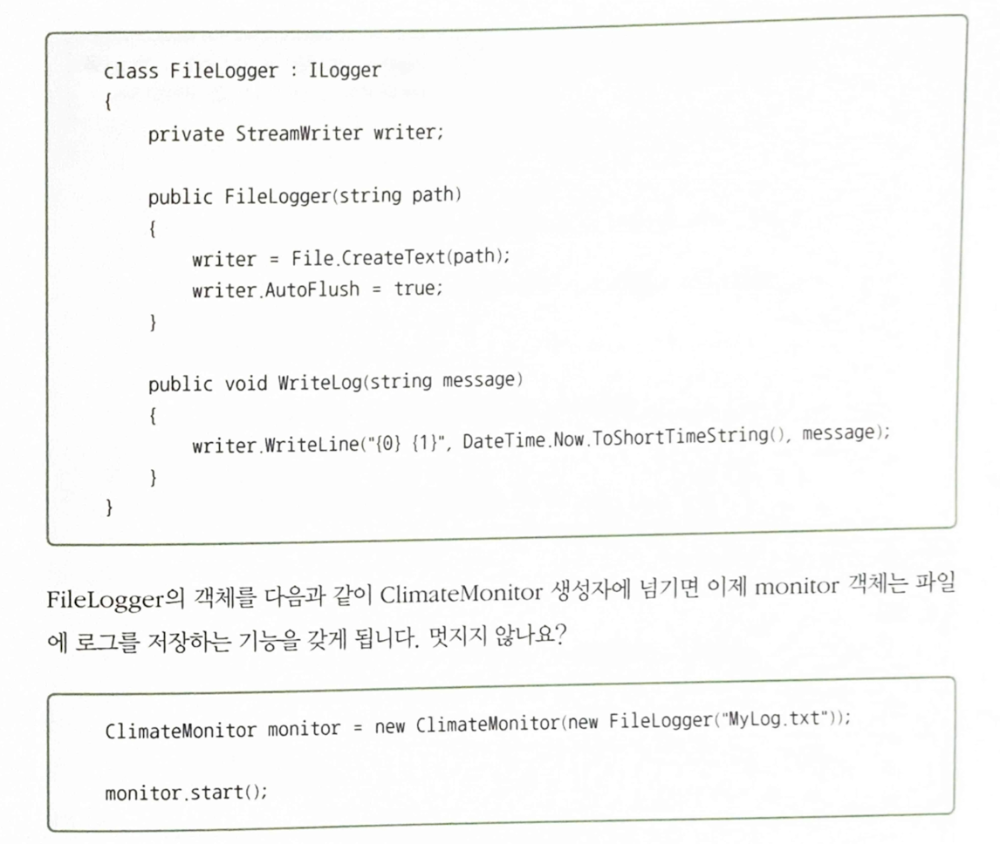

### 1.3 인터페이스를 상속하는 인터페이스

- 기존 인터페이스에 새로운 기능을 추가하고 싶은 경우
  - 이때 그냥 인터페이스 수정하면 되지 않나 생각하지만 그럴 수 없는 경우에 사용

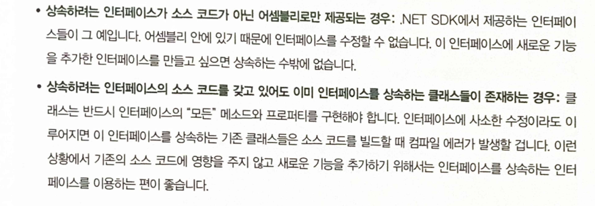

- 하는 법

  

### 1.4 여러 개의 인터페이스, 한꺼번에 상속하기

- 클래스는 여러 클래스를 한꺼번에 상속할 수 없음
  - 죽음의 다이아몬드 라는 문제 때문
    - 최초의 클래스가 두개의 파생클래스로부터 상속받고,
      - 이 두개의 파생 클래스가 다시 하나의 클래스를 상속하는 것
    - 이렇게 하면 안되는게 같은 메소드 이름이라면 컴파일러에서 무엇을 물려받게 할지 혼동할 수 있음

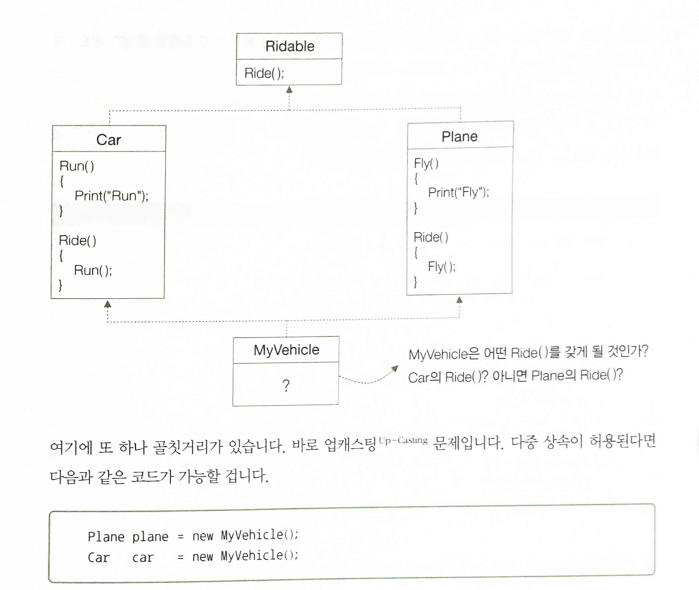

- 이런 이유로 다중 상속은 지원하지 않음
  - 다른 클래스에서 구현된 기능을 얻는 기법에는 상속만 있는 것이 아님
  - 상속은 그저 구현을 물려받기 위한 장치가 아닌 다형성을 위한 
    - 즉, 다양한 버전의 모습을 가지도록 하는 장치임

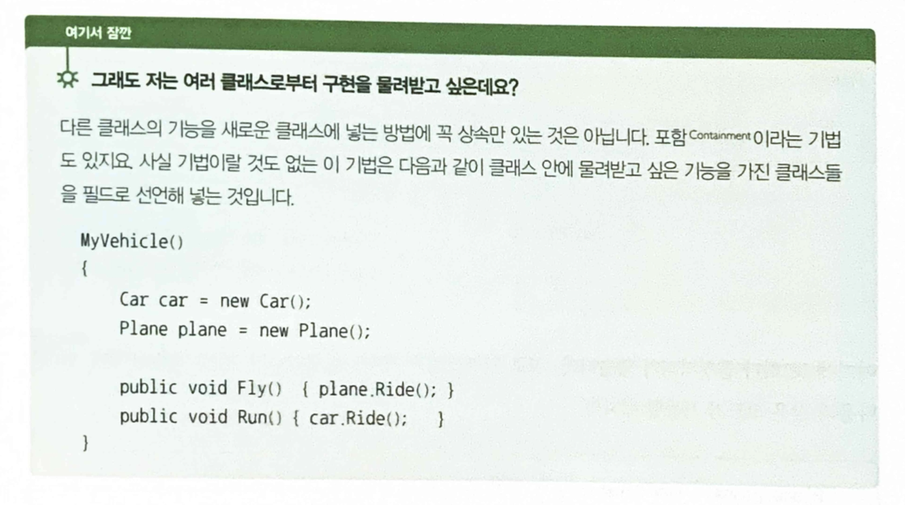

## 2.다중인터페이스 구현해보기

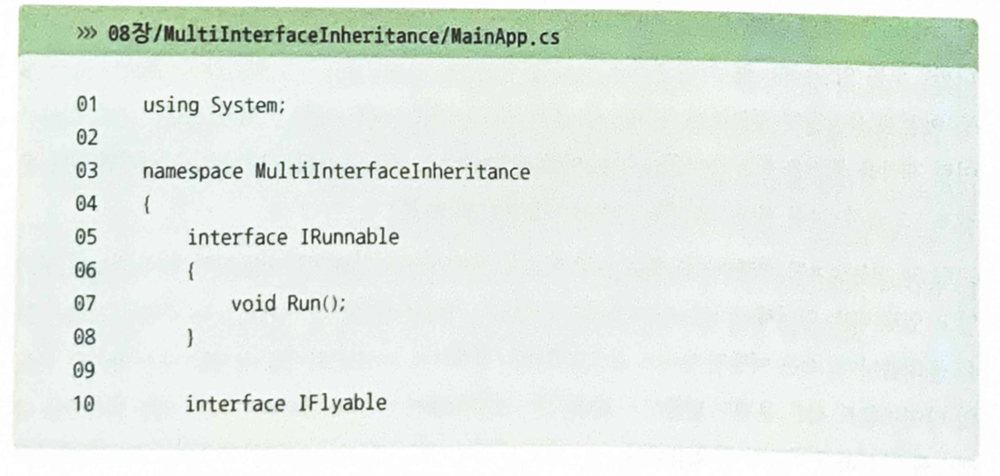

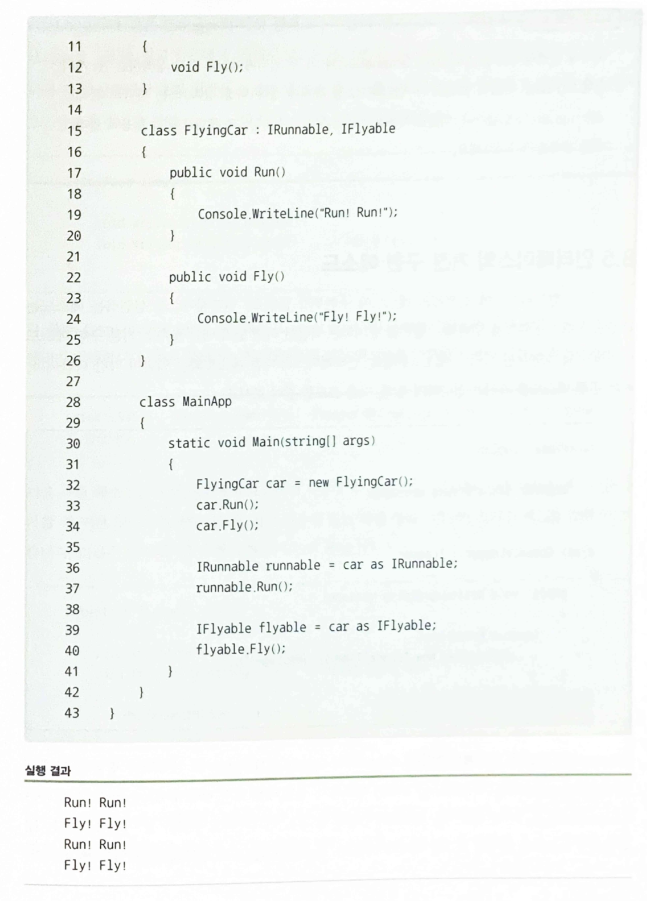

### 3. 인터페이스의 기본 구현 메소드

- 기본 구현 메소드는 
  - 구현부를 가지는 메소드
    - 인터페이스의 다른 메소드와는 역할이 다름

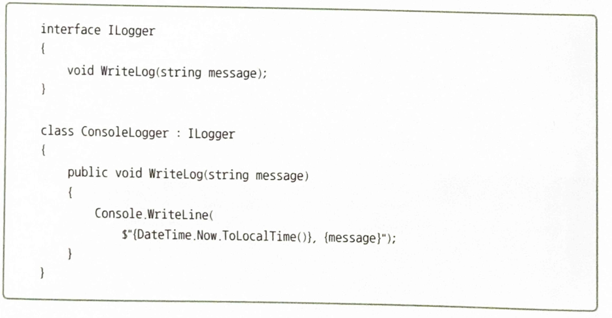

- 이렇게 하지만 이런 경우가 여러개에 인터페이스가 상속이 되었다는 과정하에

- 기본 구현 메소드 사용법
  - 인터페이스에 새로운 메소드르 추가할 때
    - 기본적인 구현체를 갖도록 해서 기존에 있는 파생클래스에서의 컴파일 에러를 막는것

- ConsoleLogger에서는 WriteError를 오버라이딩 하지 않아서 에러 생기는 것

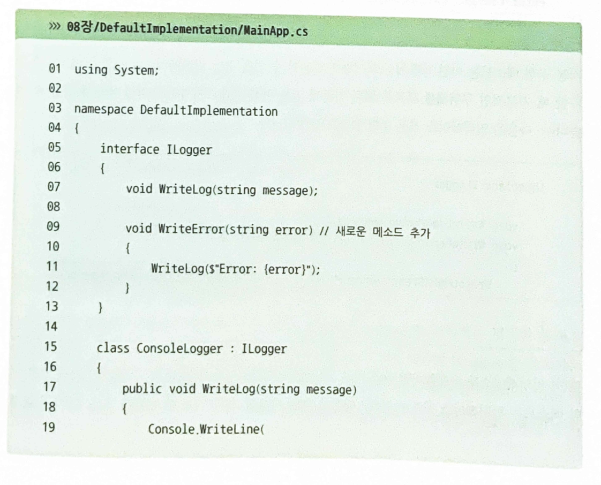

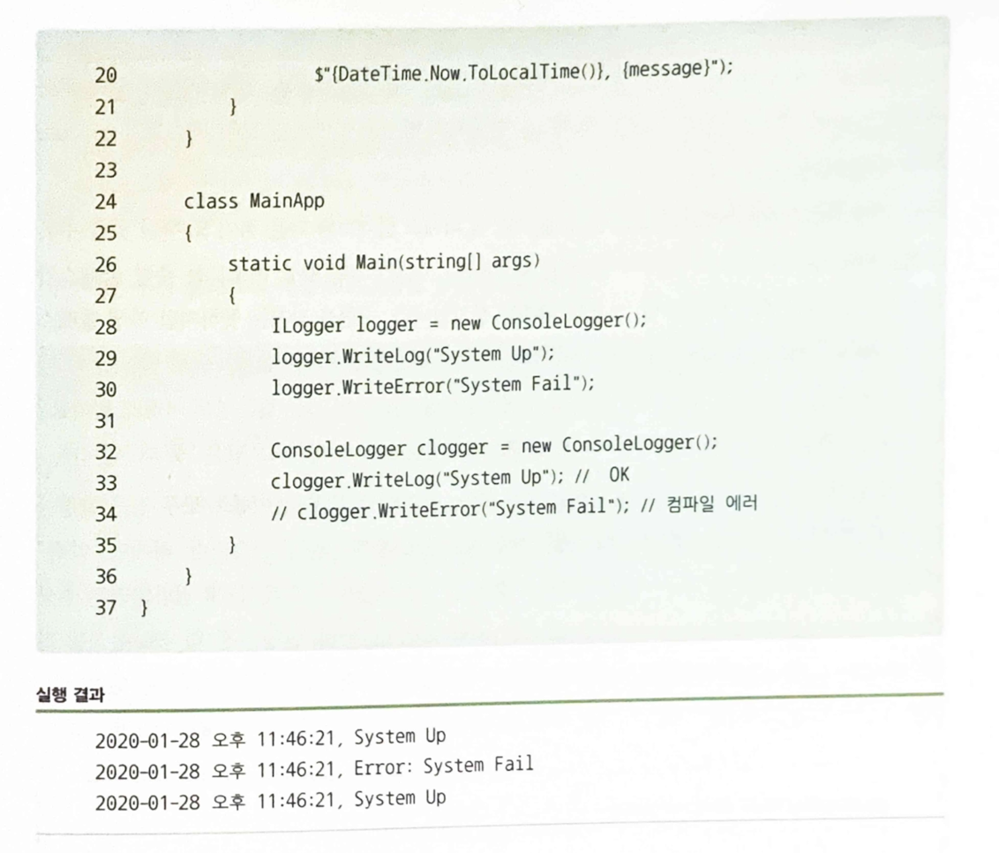

## 3.추상클래스 : 인터페이스와 클래스 사이

- 추상 클래스는 구현을 가질 수 있음
  - 그렇지만 인스턴스를 가질 수 없음

- 추상 클래스는 클래스에 더 가까움
  - 접근성이 그 예임
  - 인터페이스는 모든 메소드가 public으로 선언되는 반면,
  - 클래스는 한정자를 명시하지 않으면 모든 메소드가 private로 선언됨
- 클래스와 또다른 점은 추상메소들를 가질 수 있는 것까지 있음

- **추상 메소드**
  - 추상 메소드는 인터페이스의 역할도 할 수 있게 해주는 장치
  - 구현을 갖지 못하지만 자식클래스(파생클래스)에서는 반드시 구현을 강제해야하기 때문
    - 즉, 추상 클래스를 상속하는 클래스들이 이 메소드를 갖고 있을 거라는 약속
- **추상 클래스**가 가질 수 있는 **한정자**
  - public, internal, protected internal중 하나
    - 왜냐면 private로 되면 상속이 안되니까 

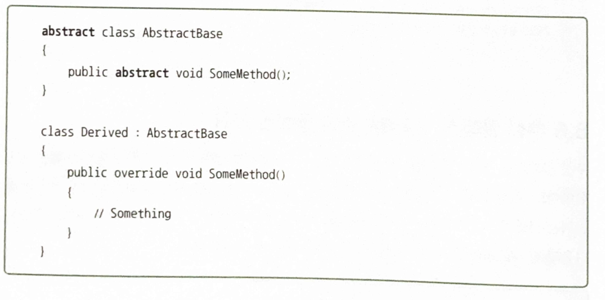

### 3.1 추상 클래스 구현해보기

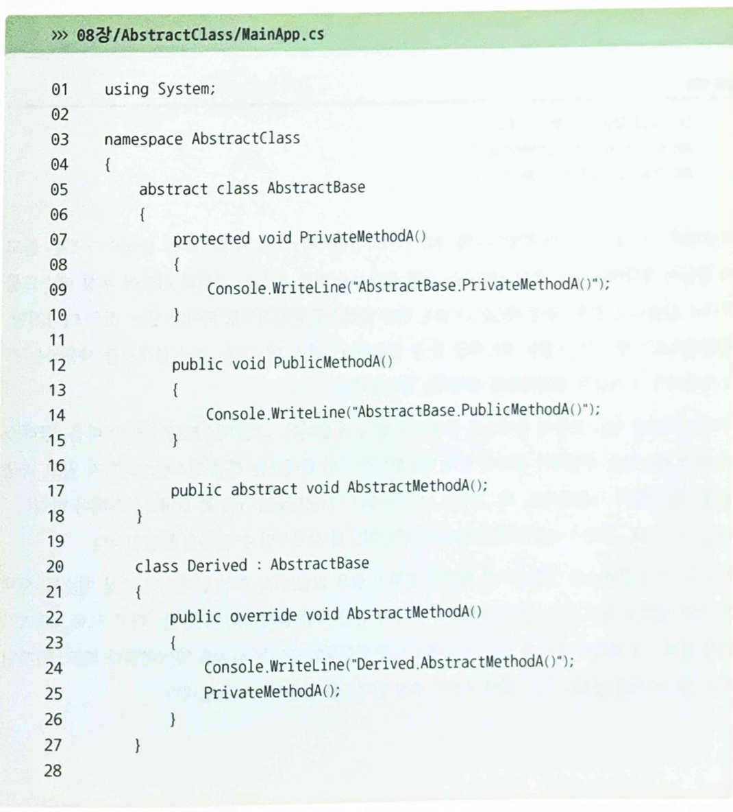

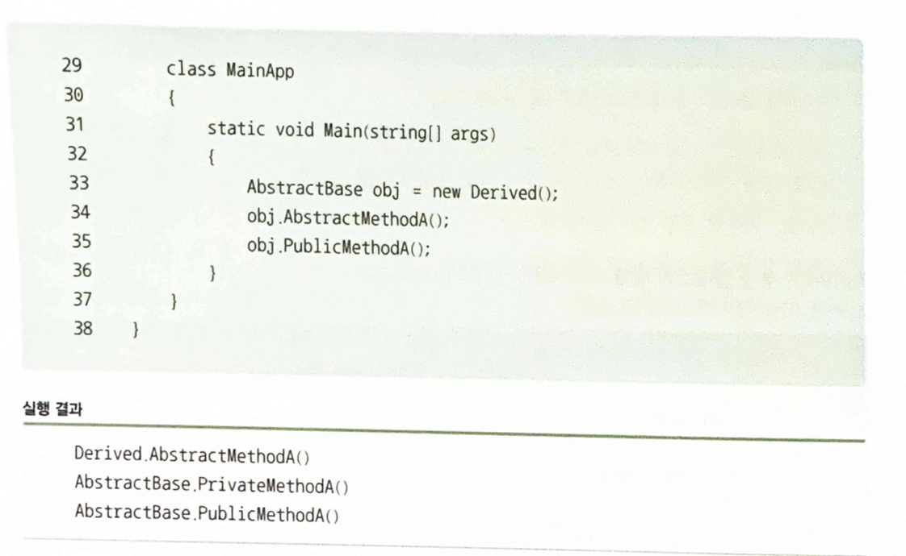

- 추상클래스의 쓸모

  - 추상클래스는 일반 클래스가 가질 수 있는 구현과
  - 추상메소드를 가지고 있음
    - 추상 메소드는 추상 클래스를 사용하는 프로그래머가 그 기능을 정의하도록 강제하는 장치

  - 클래스 상속 사용시
    - 클래스에서는 직접 이 클래스를 인스턴스화 하지 말고 
      - 파생 클래스 만들어서 사용해라 
      - 그리고, A(), B() 메소드를 꼭 오버라이딩 해야 한다고 메뉴얼 을 말했다고 했을때
        - 개발자들이 준수하도록 강제 시킬 수 없음

  - 추상 클래스 상속 사용시
    - 위와 같은 설명없이 강제 시킬 수 있음
      - 그래서 추상 클래스를 사용한다.

