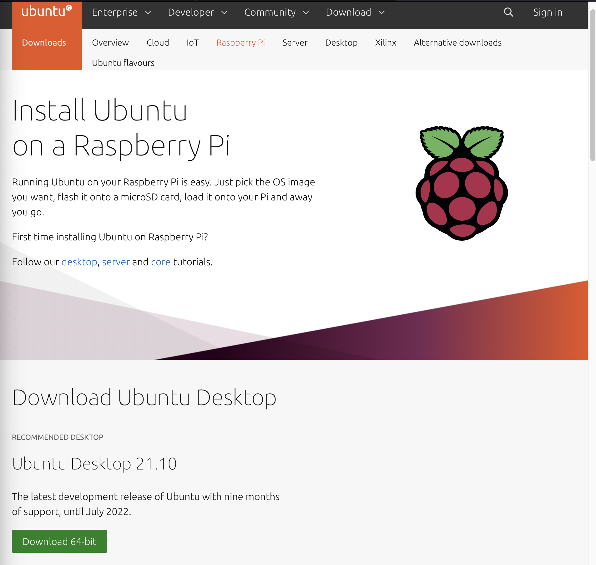

## 22.03.12_라즈베리파이서버구축하기

## 1.우분투 설치

[다운로드 링크](https://ubuntu.com/download/raspberry-pi)



- Download Ubuntu를 설치해야한다.
  - Download 64 bit를 클릭한다.


- 설치를 진행하는데 조금 기다려주자..

## 2.라즈베리파이에 우분투 설치하기

https://www.raspberrypi.com/software/

- 우선 위의 사이트로 가서 중요한것은 이미지를 sd카드에 넣어줄 imager를 설치한다


- 항상 하던대로 설치를 진행하면된다.

## 3.이미지탑재하기


- 설치를 하고 열면 위와 같은 화면이 나오는데 우선 Choose starage를 선택


- 원하는 곳에 해주면된다.
- 그리고 choose os를 클릭하면


- 이런화면이 나오는데 일단 sd카드 삭제를 위해 erase를 클릭해주고


- 저렇게 나오게되는데 write를 클릭하면 sd카드가 삭제가 된다.
- 그리고 os설치를 operating system에서 클릭하고 


- 위와 같이 되는데 write를 누르고 기다리면 sd카드에 우분투가 설치가 된다.

## 4.우분투실행

- 라즈베리 전원을 연결하고 우선 모니터와 연결하면 위와 같은 상태를 볼 수 있음


- 현재는 아이디와 비번을 입력해서 저렇지만

- 초기 아이디와 비번은 아래와 같음

  - 아이디: ubuntu

  - 비번: ubuntu

- 이렇게 하면 우선 완료인데 우리는 항상 모니터를 켜놓을 수 없으니 접근할수 있도록 설정해야함

- 그러기 위해서는 ip주소를 알아야하는데

  - Ifconfig 하면 현재 연결된 주소가 나오는데 처음에 명령을 친다고해서 안나온다.
  - 설치를 해줘야하는데 아래와 같음

### 4.1초기설정 및 네트워크확인

```sh
sudo apt-get update

sudo apt-get full upgrade

sudo apt install net-tools
```

- 초기에 우선 업데이트 업그레이드하고 저 툴을 설치해야 ip주소를 확인 할 수 있음

## 5.ssh접속해보기

- 우선 아이피 주소가 192.111.111.111이라고 해보면

- 맥기준 iterm에서 아래와 같이 명령어를 입력해보자

  ```sh
  ssh ubuntu@192.111.111.111
  ```

  - 비번을 입력하라고 하는데 새로 설정한 비번이나 설정을 입력하면 된다,.


## 6.ssh error


- 이렇게 에러가 생긴다면 

  - ip로 기존에 접속한 경우 서버와 RSA 공유키를 교환한 상태라서 초기화 해줘야함

  ```sh
  ssh-keygen -R 192.168.0.7
  ```

  - 192.168.0.7은 현재 라즈베리가 연결된 서버 주소이다.

## 7.우분투 도커 설치

### 7.1 오래된 버전 삭제

```sh
sudo apt-get remove docker docker-engine docker.io containerd runc
```


### 7.2 repository 설정하기

```sh
sudo apt update

sudo apt-get install -y ca-certificates \ 
    curl \
    software-properties-common \
    apt-transport-https \
    gnupg \
    lsb-release
```

### 7.3 docker 설치

```sh
curl -fsSL https://download.docker.com/linux/ubuntu/gpg | sudo gpg --dearmor -o /usr/share/keyrings/docker-archive-keyring.gpg
```

- 공식 gpg key 추가

```sh
echo \
  "deb [arch=amd64 signed-by=/usr/share/keyrings/docker-archive-keyring.gpg] https://download.docker.com/linux/ubuntu \
  $(lsb_release -cs) stable" | sudo tee /etc/apt/sources.list.d/docker.list > /dev/null
```

- Apt source list에 repository추가

```sh
sudo apt-get update

sudo apt-get install docker-ce
```

- 가끔 설치가 안되는 경우가 있음

  - 그럴때는 아래와 같이 해보자

    ```sh
    curl -fsSL https://download.docker.com/linux/ubuntu/gpg | sudo apt-key add -
    sudo add-apt-repository "deb [arch=amd64] https://download.docker.com/linux/ubuntu $(lsb_release -cs) stable"
    sudo apt-get update
    sudo apt-get install -y docker.io
    ```

- 설치 확인

  - `docker -v`


### 7.4 docker-compose 설치

```sh
sudo curl -L https://github.com/docker/compose/releases/download/v2.1.0/docker-compose-`uname -s`-`uname -m` -o /usr/local/bin/docker-compose

sudo chmod +x /usr/local/bin/docker-compose

docker-compose --version
```

- 순서대로 입력해보자


- 위까지 설치됬으면 완료임

