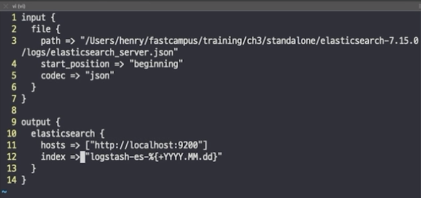

## 22.02.07_ELK클러스터구성

## 1.클러스터

- 아무설정하지 않았는데 클러스팅되는것은
  - 같은 네트워크에 있는 클러스터 네임이 같은 것을 알아서 찾아서 구성함

## 2.노드의 Role

- node.master: true
- node.data : true
  - 또는
- node.roles["master", "data"]
- 마스터 노드로만
  - node.roles["master"]
- 마스터 노드랑 데이터 노드로 설정
  - node.roles["master", "data"]

## 3.Cluster Node 구성 -변경

- data -d
- ingest -i
- master -m
- remote_cluster_client -r 
  - 우리가 흔히 ccs라는 cross cluster search라고각각의 클러스터각의 데이터를 조회하는 용도로 쓰는 것
- "-" coordinating node only 
  - 데이터만 받는 용도만

## 4.도커이용한 클러스터 설정

- 요새는 각각의 yml을 이용해서 사용함
  - 고스펙의 장비에서 여러 인스턴스를 구성할 때는 한번에 하지만 
  - 개별로 하는것이 일반적이고 좋다

### 4.1 docker-compose

- 설정은 동일하고 노드 이름만 다름
- discovery.seed.hosts설정과 cluster.initial_master설정이 필요
  - 클러스터 구성시 필요한 것

## 5.키바나

- 저장된 데이터를 조회하고 분석할 수 있도록 기능을 제공해주는 도구
- 초기는 Dashboard, visulization 제공 용도
- 현재는elk stack운영하고 모니터링 용도까지 확대

## 6.로그스태시

- 에이전트로 쓰기에는 무거움
- 실행이 오래걸림

- 위와 같이 설정을 진행하고
- 다양한 정보는 로그스태시 공식 문서보고 참고하면됨

ㄴ