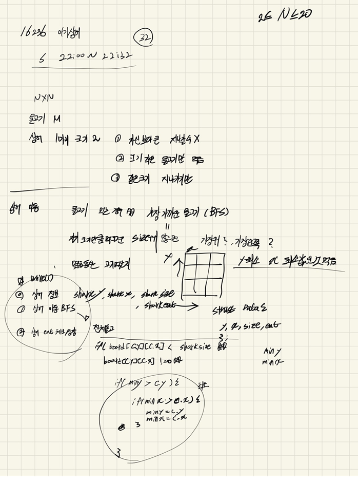

## 22-04-24-16236-아기상어

## 목차

> 01.거리최소값 구하기
>
> 02.BFS
>
> 03.전체소스



## 01.거리최소값구하기

- 조건은 최소의 거리이고 
  - 최소가 많은 경우 y가 최소이고 
    - y가최소인게 많으면 x가 최소인 것

```c++
if (board[c.y][c.x]!=0&&board[c.y][c.x]<shark.size&&minCnt >= c.eat) {//최소값
    minCnt = c.eat;
    if (minY > c.y || (minY == c.y&&minX > c.x)) {
        minY = c.y;
        minX = c.x;
    }
}
```

## 02.BFS

- 모든 경우를 확인 대신 최소를 저장하면서 확인 진행
  - 최소의 모든 경우를 보는 이유는 최소가 여러개이기 때문

```c++
while (!s.empty()) {
    Data c = s.front(); s.pop();
    if (board[c.y][c.x]!=0&&board[c.y][c.x]<shark.size&&minCnt >= c.eat) {//최소값
        minCnt = c.eat;
        if (minY > c.y || (minY == c.y&&minX > c.x)) {
            minY = c.y;
            minX = c.x;
        }
    }

    for (int dir = 0; dir < 4; dir++) {
        Data n;
        n.y = c.y + dy[dir]; n.x = c.x + dx[dir];
        n.eat = c.eat + 1;
        if (safeZone(n.y, n.x) && visit[n.y][n.x] == 0 && board[n.y][n.x] <= shark.size) {
            visit[n.y][n.x] = 1;
            s.push(n);
        }
    }
}//while(!s.empty())
```

## 03.전체소스

```c++
#include<stdio.h>
#include<iostream>
#include<vector>
#include<queue>
#include<string.h>
#define NS 24
using namespace std;
int board[NS][NS];
int dy[] = { 0,1,0,-1 };
int dx[] = { 1,0,-1,0 };
int N, ret;
struct Data {
	int y, x, size, eat;
}shark;

bool safeZone(int y, int x) {
	return 0 <= y && y < N && 0 <= x && x < N;
}

void init()
{
	N = ret = 0;
	memset(board, 0, sizeof(board));
	scanf("%d", &N);
	for (int i = 0; i < N; i++) {
		for (int j = 0; j < N; j++) {
			scanf("%d", &board[i][j]);
			if (board[i][j] == 9) {// 상어 위치 표기
				shark.y = i; shark.x = j;
				shark.size = 2; shark.eat = 0;
				board[i][j] = 0;
			}
		}
	}
}

void eatFish()
{
	while (1) {
		queue<Data>s;
		s.push({shark.y,shark.x,0,0});
		int minY = 0x7fffffff; int minX = 0x7fffffff; int minCnt = 0x7fffffff;
		int visit[NS][NS] = { 0, };
		while (!s.empty()) {
			Data c = s.front(); s.pop();
			if (board[c.y][c.x]!=0&&board[c.y][c.x]<shark.size&&minCnt >= c.eat) {//최소값
				minCnt = c.eat;
				if (minY > c.y || (minY == c.y&&minX > c.x)) {
					minY = c.y;
					minX = c.x;
				}
			}
			
			for (int dir = 0; dir < 4; dir++) {
				Data n;
				n.y = c.y + dy[dir]; n.x = c.x + dx[dir];
				n.eat = c.eat + 1;
				if (safeZone(n.y, n.x) && visit[n.y][n.x] == 0 && board[n.y][n.x] <= shark.size) {
					visit[n.y][n.x] = 1;
					s.push(n);
				}
			}
		}//while(!s.empty())
		if (minY == 0x7fffffff)break;// 먹을수 있는 물고기 없는 경우
		ret += minCnt;
		shark.eat++;
		if (shark.eat == shark.size) {//상어 성장
			shark.eat = 0;
			shark.size++;
		}

		shark.y = minY; shark.x = minX;
		board[shark.y][shark.x] = 0;
	}//while(1)
}
int main(void)
{
	int testCase = 1;
	for (int tc = 1; tc <= testCase; tc++) {
		init();
		eatFish();
		//printf("#%d %d\n", tc, ret);
		printf("%d\n",ret);
	}
	return 0;
}
```

