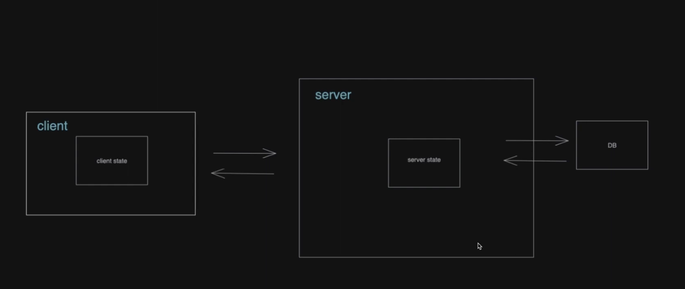

## 2022-02-18-reactQuery-study

## Hook

- 원래 존재하는 어떤 기능에 마치 갈고리를 거는 것처럼 끼어 들어가 같이 수행되는 것
  - 리액트의 훅의 경우 state와 생명주기 기능에 갈고리를 걸어 원하는 시점에 정해진 함수를 실행되도록 만든 것

### Hook의 종류

- useState
- useEffect
  - 함수 컴포넌트에서 사이드 이펙트를 실행 할 수 있도록 해주는 훅
  - 제공하는 생명주기 함수
    - componentDidMount()
    - componentDidUpdate()
    - componentWillUnmount()
  - DOM이 변경된 이후에 해당 이펙트 함수를 실행하라는 의미로 사용 가능
    - 배열없이 사용시
- useMemo
  - Memoized value를 리턴하는 훅
    - 메모이제이션의 개념처럼 의존성 배열에 들어있는 변수가 변했을 경우에만
      - 새로운 create함수를 호출하여 결괏값 반환
  - 컴포넌트가 다시 렌더링될 때마다 연산량이 높은 작업을 반복하는 것을 피할 수 있음
    - 랜더링이 일어나는 동안 실행됨
- useCallback
  - useMemo와 비슷한 역할
  - 단, 값이 아닌 함수를 반환한다는 점
- useRef
  - 레퍼런스를 사용하기 위한 훅

* 리액트 레퍼런스란?
  * 특정 컴포넌트에 접근할 수 있는 객체

## 훅의 규칙

- 첫 번째
  - 훅은 무조건 최상위 레벨에서만 호출
    - 여기서 말하는 최상위 레벨은 리액트 함수 컴포넌트의 최상위 레벨
    - 즉, 반복문이나 조건문 또는 중첩된 함수에 호출하면 안됨
  - 이 규칙에 따라서 휵은 컴포넌트가 렌더링 될때마다 매번 같은 순서로 호출되어야 함

- 두 번째
  - 리액트 함수 컴포넌트에서만 훅을 호출
    - 훅은 리액트 함수 컴포넌트에서 호출하거나 직접 만든 커스텀 훅에서만 호출 가능

## 나만의 훅 만들기

### 커스텀 훅을 만들어야 하는 상황

```react
import React, {useState, useEffect} from "react";

function UserStatus(props){
  const [isOnline, setIsOnline] = useState(null);
  
  useEffect(()=>{
    function handleStatusChange(state){
      setIsOnline(status.isOnline);
    }
    
    ServerAPI.subcribeUserStatus(prpos.user.id, handleStatusChange);
    return() =>{
      ServerAPI.unsubscribeUserStatus(props.user.id, handleStatusChange);
    };
  });
  
  if(isOnline === null){
			return  '대기중...';
  }
  return isOnline ? '온라인' : '오프라인';
}
```

- 동일한 웹사이트에서 연락처 목록을 제공하는데 이때 온라인인 사용자의 이름은 초록색으로 표시해주고 싶다고 가정

  ```react
  import React, {useState, useEffect} from "react";
  
  function UserListItem(props){
    const [isOnline, setIsOnline] = useState(null);
    
    useEffect(()=>{
      function handleStatusChange(status){
        setIsOnline(status.isOnline);
      }
      
      ServerAPI.subscribeUserStatus(props.user.id, handleStatusChange);
      return () => {
        ServerAPI.unsubscribeUserStatus(prpos.user.id, handleStatusChange);
      };
    });
    
    return (
    	<li style={{ color: isOnline ?  'green' :  'black' }}>
        {props.user.name};
      </li>
    )
  }
  ```

## 커스텀 훅 추출하기

```react
import {useState, useEffect} from "react";

function useUserStatus(userId){
	const [isOnline, setIsOnline] = useState(null);
  
  useEffect(()=>{
    function handleStatusChange(status){
      setIsOnline(status.isOnline);
    }
    
    ServerAPI.subscribeUserStatus(userId, handleStatusChange);
    return () => {
				ServerAPI.unsubscribeUserStatus(userId, handleStatusChange);
      };
  });
  
  return isOnline;
}
```

## 커스텀 훅 사용하기

```react
function UserStatus(prpos){
	const isOnlline = useUserStatus(prpos.user.id);
  
  if(isOnline === null){
		return '대기중...';
  }
  
  return isOnline ? '온라인' : '오프라인';
}

function UserListItem(props){
	const isOnline = useUserStatus(props.user.id);
	
  return (
  	<li style={{color:isOnline ? 'green' : 'black'}}>
      {props.user.name}
    </li>
  )
}
```

# 리액트 쿼리 왜쓰나?

- 서버에서 가져온 데이터 웹 브라우저 앱에서 사용하기 쉽게 도와줌

- 서버에서 가져온 데이터 서버 state
- 모든 어플리케이션 state 가지고 있음



## 클라이언트 state

- 클라이언트가 최초 발생지
- 서버가 최초 발생지

### external state

- 리덕스, 몹엑스, 저스탠드, 조타이, 리코일등등

### internal state

- Context api, useState

## 클라이언트가 자체적으로 만드는 state

- 대개 UI를 담당하는 부분으로 모다이 열리고 닫히는지
- 어떤 버튼이 클릭되었는지
- 지금 창이 리사이징 되고 있는지 여부등 메타 정보를 담은 상태값

## React query가 해결해주는 문제

- 간편한 server state 수급 방식
  - 실시간 데이터가 필요한 경우 더 좋은 경우로 사용됨
- 캐시
  - 몇초 이후에는 데이터가 유효하지 않은 거으로 간주하고 데이터를 다시 불러오
  - 데이터에 변경점이 있는 경우에만 리렌더링을 유발
  - 유저가 탭을 이동했다가 다시 돌아왔을때 데이터를 다시 불러옴
  - 데이터를 다시 호출할 때 응답이 오기 전까지 이전 데이터를 계속 보여줌
  - 필요에 따라서 로딩바와 같은 대안 UI를 보여주기 위해 loading state를 기본적으로 제공

<<<<<<< HEAD
## 설치 

```js
npm install react-query

index.js

cost queryClient = new QueryClient()

<QueryClientProvider Client={queryClient}>
```

- 장점 
- ajax 성공 실패 로딩중 파악 쉬움
- 리패치
- 실패시 재시도 해줌
- stata 공유 필요 없음
- 캐싱 해줌 

# 기본 소스틀

```tsx
//1
useQuery("작명", ()=>{
      return axios.get("https://codingapple1.github.io/userdata.json").then((a)=>{
      return a.data
      })
   })

//2 
let result = useQuery("작명", ()=>
      axios.get("https://codingapple1.github.io/userdata.json").then((a)=>{
      console.log("요청확인")
      return a.data
      })
   )
```

## 데이터 가져오는 소스

```tsx
result.data
```

## 로딩시 소스

```tsx
result.isLoading

result.isLoading ? "로딩중" : "로딩완료"
result.isLoading&&"로딩중"
```

## 에러 발생시 소스

```tsx
result.error
```
=======
## React query 사용법


>>>>>>> e25b0cb5bc033de85351be5cbe097d92d339c838

## 참고자료

https://tanstack.com/query/v4/docs/react/overview

