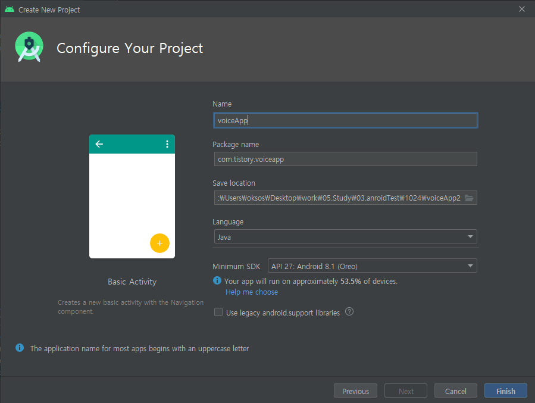
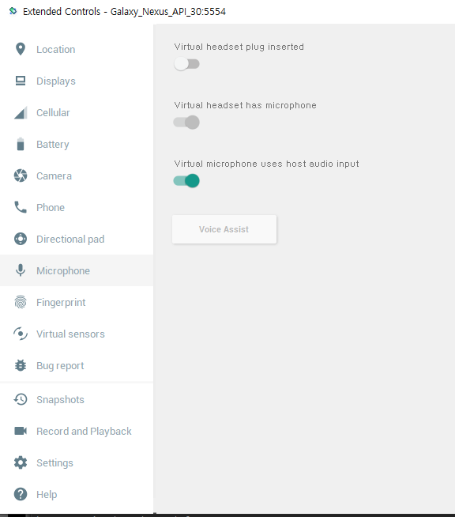
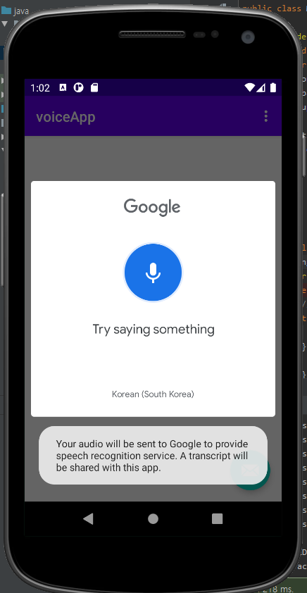
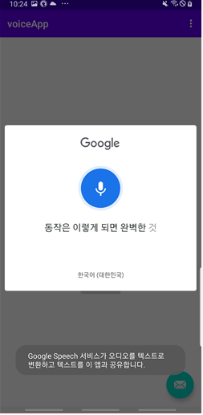
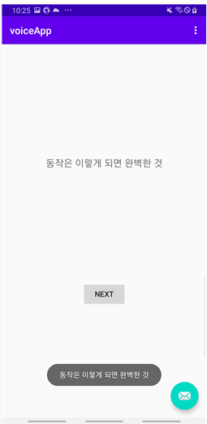

## 2021.10.31_4.5음성인식노트앱만들기

## 앱만들기


- 이번에는 Basic Activity이용



- 이전에 버전업이되어서 최소 SDK를 26이상 해야 실행이됨

## res/layout/frament.xml

### before

```xml
    <TextView
        android:id="@+id/textview_first"
        android:layout_width="wrap_content"
        android:layout_height="wrap_content"
        android:text="@string/hello_first_fragment"
        app:layout_constraintBottom_toTopOf="@id/button_first"
        app:layout_constraintEnd_toEndOf="parent"
        app:layout_constraintStart_toStartOf="parent"
        app:layout_constraintTop_toTopOf="parent" />
```

### after

```xml
    <TextView
        android:id="@+id/tvVoice"
        android:layout_width="wrap_content"
        android:layout_height="wrap_content"
        android:text="@string/hello_first_fragment"
        android:textSize="20dp"
        app:layout_constraintBottom_toTopOf="@id/button_first"
        app:layout_constraintEnd_toEndOf="parent"
        app:layout_constraintStart_toStartOf="parent"
        app:layout_constraintTop_toTopOf="parent" />
```


## Sync, Asynce

- 동기 
  - 함수가 올때 까지 기다리고
- 비동기
  - 함수 호출하자마자 다른 함수 호출되서 다른 화면이 실행하면서도 화면이 실행이되는것
  - 다른 행동을 할떄 다른것도 동작을 하게 하기 위해서 사용함

## 중요한것은 마이크 설정



- 가상 머신이라면 저렇게 해야 실행시 제대로 동작함



- 이렇게 일단 나옴 

## MainActivity.java

```java
    @Override
    protected void onCreate(Bundle savedInstanceState) {
        super.onCreate(savedInstanceState);
        setContentView(R.layout.activity_main);
        Toolbar toolbar = findViewById(R.id.toolbar);
        setSupportActionBar(toolbar);

        FloatingActionButton fab = findViewById(R.id.fab);
        fab.setOnClickListener(new View.OnClickListener() {
            @Override
            public void onClick(View view) {
                Snackbar.make(view, "Replace with your own action", Snackbar.LENGTH_LONG)
                        .setAction("Action", null).show();
                VoiceTask voiceTask = new VoiceTask();
                voiceTask.execute();
            }
        });
    }
    public class VoiceTask extends AsyncTask<String, Integer, String> {
        String str = null;
        @Override
        protected String doInBackground(String... params) {
            // TODO Auto-generated method stub
            try {
                getVoice();
            } catch (Exception e) {
                // TODO: handle exception
            }
            return str;
        }

        protected void onPostExecute(String result) {
            try {

            } catch (Exception e) {
                Log.d("onActivityResult", "getImageURL exception");
            }
        }
    }
    private  void getVoice(){
        Intent intent = new Intent();
        intent.setAction(RecognizerIntent.ACTION_RECOGNIZE_SPEECH);
        intent.putExtra(RecognizerIntent.EXTRA_LANGUAGE_MODEL,
                RecognizerIntent.LANGUAGE_MODEL_FREE_FORM);
        String language = "ko-KR";

        intent.putExtra(RecognizerIntent.EXTRA_LANGUAGE, language);
        startActivityForResult(intent,2);
    }
    ...
}
```

```java
@Override
protected void onActivityResult(int requestCode, int resultCode, Intent data) {
    // TODO Auto-generated method stub
    super.onActivityResult(requestCode, resultCode, data);

    if (resultCode == RESULT_OK) {

        ArrayList<String> results = data
                .getStringArrayListExtra(RecognizerIntent.EXTRA_RESULTS);

        String str = results.get(0);
        Toast.makeText(getBaseContext(), str, Toast.LENGTH_SHORT).show();

        TextView tv = findViewById(R.id.tvVoice);
        tv.setText(str);
    }
}
```

- ...아래 바로 넣는다 이게 핵심 소스이다.

##  MainActivity.java

```java
package com.tistory.voiceapp;

import android.content.Intent;
import android.os.AsyncTask;
import android.os.Bundle;

import com.google.android.material.floatingactionbutton.FloatingActionButton;
import com.google.android.material.snackbar.Snackbar;

import androidx.appcompat.app.AppCompatActivity;
import androidx.appcompat.widget.Toolbar;

import android.speech.RecognizerIntent;
import android.util.Log;
import android.view.View;

import android.view.Menu;
import android.view.MenuItem;
import android.widget.TextView;
import android.widget.Toast;

import java.util.ArrayList;

public class MainActivity extends AppCompatActivity {

    @Override
    protected void onCreate(Bundle savedInstanceState) {
        super.onCreate(savedInstanceState);
        setContentView(R.layout.activity_main);
        Toolbar toolbar = findViewById(R.id.toolbar);
        setSupportActionBar(toolbar);

        FloatingActionButton fab = findViewById(R.id.fab);
        fab.setOnClickListener(new View.OnClickListener() {
            @Override
            public void onClick(View view) {
                Snackbar.make(view, "Replace with your own action", Snackbar.LENGTH_LONG)
                        .setAction("Action", null).show();
                VoiceTask voiceTask = new VoiceTask();
                voiceTask.execute();
            }
        });
    }
    public class VoiceTask extends AsyncTask<String, Integer, String> {
        String str = null;
        @Override
        protected String doInBackground(String... params) {
            // TODO Auto-generated method stub
            try {
                getVoice();
            } catch (Exception e) {
                // TODO: handle exception
            }
            return str;
        }

        protected void onPostExecute(String result) {
            try {

            } catch (Exception e) {
                Log.d("onActivityResult", "getImageURL exception");
            }
        }
    }
    private  void getVoice(){
        Intent intent = new Intent();
        intent.setAction(RecognizerIntent.ACTION_RECOGNIZE_SPEECH);
        intent.putExtra(RecognizerIntent.EXTRA_LANGUAGE_MODEL,
                RecognizerIntent.LANGUAGE_MODEL_FREE_FORM);
        String language = "ko-KR";

        intent.putExtra(RecognizerIntent.EXTRA_LANGUAGE, language);
        startActivityForResult(intent, 2);

    }

    @Override
    protected void onActivityResult(int requestCode, int resultCode, Intent data) {
        // TODO Auto-generated method stub
        super.onActivityResult(requestCode, resultCode, data);

        if (resultCode == RESULT_OK) {

            ArrayList<String> results = data
                    .getStringArrayListExtra(RecognizerIntent.EXTRA_RESULTS);

            String str = results.get(0);
            Toast.makeText(getBaseContext(), str, Toast.LENGTH_SHORT).show();

            TextView tv = findViewById(R.id.tvVoice);
            tv.setText(str);
        }
    }
    @Override
    public boolean onCreateOptionsMenu(Menu menu) {
        // Inflate the menu; this adds items to the action bar if it is present.
        getMenuInflater().inflate(R.menu.menu_main, menu);
        return true;
    }

    @Override
    public boolean onOptionsItemSelected(MenuItem item) {
        // Handle action bar item clicks here. The action bar will
        // automatically handle clicks on the Home/Up button, so long
        // as you specify a parent activity in AndroidManifest.xml.
        int id = item.getItemId();

        //noinspection SimplifiableIfStatement
        if (id == R.id.action_settings) {
            return true;
        }

        return super.onOptionsItemSelected(item);
    }
}
```



- 위와 같이 제대로 동작함을 알 수 있음

## 원본
