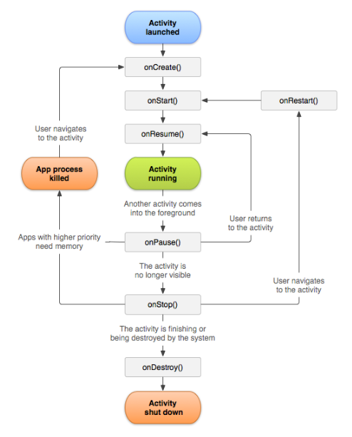
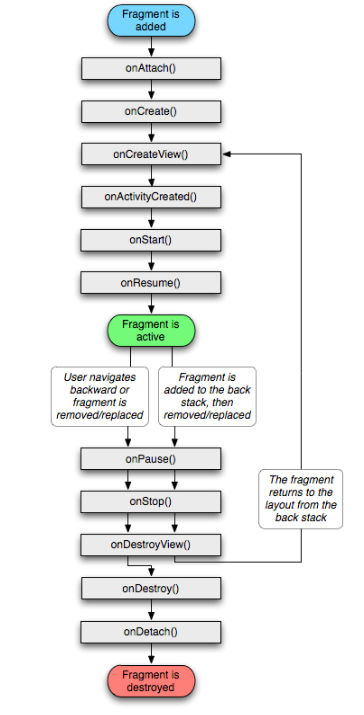
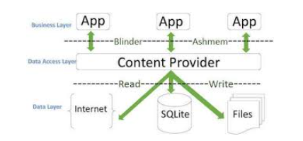

## 2021.09.16_안드로이드3

## 1. Thread간 통신방법

- Handler를 이용
  - 두 개 이상의 스레드를 사용할 때의 동기화 이슈를 차단하기 위해 
    - Looper와 Handler를 사용

## 2.Handler설명

- Handler는 Looper로 부터 받은 Message를 실행, 처리하거나
  - 다른 스레드로 부터  메시지를 받아서 Message Queue에 넣는 역할을 하는 스레드간의 통신 장치
- 일반적으로 UI갱신을 위해 사용
  - 뷰나 뷰그룹에서 제공하는 메소드는 단일 스레드 모델(Thread-Unsafe)
  - 핸들러는  두 종류의 객체를 메시지 큐(Message Queue)를 통해 특정 스레드로 전달
- 문자와 필드로 구성된 메시지 객체 & Runnable 객체

## 3.Looper에 대해 설명

- Looper는 무한히 루프를 돌며 자신히 속한 스레드의 Message Queue에서 Message나 Runnable객체를 
  차례로 꺼내 Handler가 처리하도록 전달
- 메인 스레드에는 Looper가 기본적으로 생성되어 있지만, 
  새로 생성한 스레드는  Looper를 가지고 있지 않기 때문에 메시지를 받을 수 없다.
  - 사용할 수 있는 메시지 큐가 없기 때문
- 서브 스레드에서 메시지를 전달받기 위해서는 Looper를 생성해주어야함
  - 그러나 , Looper 자동 보유 클래스 -> HandlerThread

## 4.백그라운드에서 UI 업데이트 하는 방법

- Handler.post,  Looper Handler, mainThread 안에 Handler 만들어 놓고,
  - 다른 쓰레드에서 메시지 넣어주기, runOnUIThread, AsynkTask

## 5. Context에 대한 설명

- 현재 사용되고 있는 어플리케이션(또는 액티비티)에 대한 포괄적인 정보를 지니고 있는 객체

## 6.Activity의 생명주기

- 앱을 사용하는 도중에 카카오톡 메세지가 온다면 사용하는 앱의 TopActivity 생명주기
  - onPause상태
- 데이터 불러오는 작업은어디서 해야하나?
  - Activity가 중지 상태에서 다시 화면에 표시되기 직전에 호출
    - onRestart -> onStart -> onResume -> ActivityRunning...
- 다른 액티비티가 상단에 올라온 경우 상태
  - Activity가 중지 상태에서 다시 화면에 표시되기 직전에 호출
    - onRestart -> onStart -> onResume -> ActivityRunning...
- onRestart는 언제 호출이 되나?
  - activity가 중지 상태에서 다시 화면에 표시되기 직전에 호출
    - onRestart -> onStart -> onResume -> ActivityRunning...

## 7.Fragment의 생명주기

- **최초 생성 LifeCycle**
  1. **onAttatch**(): Fragment가 Activity에 붙을 때 호출
  2. **onCreate**(): Activity에서의 onCreate()와 비슷, UI관련 작업 X
  3. **onCreateView** (): Layout을 inflater하여 View작업
  4. **onActivityCreated**(): Activity에서 Fragment를 모두 생성하고 난 다음 호출,
     - 액티비티의 onCreate()에서 setContentView()한 다음이라고 생각하면됨
       - 여기서 부터는 UI 변경 작업이 가능
  5. **onStart**(): Fragment가 화면에 표시될 때 호출
     - 사용자의 Action과 상호 작용 할 수 없음
  6. **onResume**(): Fragment가 화면에 완전히 그렸으면, 사용자의 Action과 상호 작용이 가능
- **다른 Fragment가 add**
  1. **onPause**(): Fragment가 사용자의 Action과 상호작용을 중지
  2. **onStop**(): Fragment가 화면세서 더 이상 보여지지 않게 되며, Fragment기능이 중지 되었을때 호출
  3. **onDestoryView**(): View리소스를 해제 할 수 있도록 호출, 
     - backstack을 사용했다면 Fragment로 다시 돌아갈때, onCreateView()가 호출
- **Replace or backward로 removed되는 경우**
  4. **onDestory**(): Fragment상태를 완전히 종료 할 수 있도록 호출
  5. **onDetach**(): Frament가 Activity와의 연결이 완전히 끊기기 직전에 호출됨

## 8.ANR 에 대한 설명

- Application Not Responding
  - 원인: 메인스레드(UI스레드)가 일정 시간 어떤 Task에 잡혀 있으면 발생
    - input 이벤트에 5초안에 반응하지 않을 때
    - BroadcastReceiver가 10초내로 실행을 하지 않을 때
      - UI가 없는 브로드캐스트 리시버, 서비스도 실행 주체가 메인스레드 이므로
        긴 시간을 소모하는 작업인 경우  ANR발생
  - 예방:
    - 시간 소모가 많은 작업은 스레드를 통해 처리
    - 사용자에게 프로그레스바 등을 이용해 작업의 진행과정을 알려기다리도록 함

## 9.Content Provider와 Content Resolver 창이

- **Content Provider**: 어플리케이션 내에서 사용할 수 있는 데이터를 '공유'하기 위한 컴포넌트
  - ex) 연락처, 이미지 등(카카오톡)
- **Content Resolver**: 앱이 ContentProvider를 접근할 때에는, Content Resolver를 통해 접근하게 됨
  - 기본적으로 CRUD함수들 제공 -> 다른 앱의 데이터베이스를 조작할 수 있음
  - ex) ContentResolver.query()

## 10.XML 기반 레이아웃은 왜 중요?

- 동작을 제어하는 코드로 부터 따로 표시하기 좋음
  - UI의 구조를 시각화 하기 더 쉬움
- 자바로 레이아웃을 작성했다면, 레이아웃을 변경할 때마다 소스를 재 컴파일 해야함

## 11.Manifest 설명

- 애플리케이션에 대한 필수적인 정보를 안드로이드 플랫폼에 알려줌
- 모든 안드로이드 앱은 반드시 AndroidManifest.xml 파일을 자신의 루트 디렉토리에 가지고 있어야함

## 12. Vector, 비트맵 이미지 차이점

- Vector: 리사이징이 되어도 전혀 깨지지 않음
  - 모든 해상도에서 자유자재로 활용할 수 있기 때문에 특정 해상도에 제한되어 있지 않다는 것이 핵심
  - ex) SVG
- 비트맵: 픽셀로 구성되어 있음, 자유자재로 바꿀 수가 없고, 움직일 수도 없음
  - ex)PNG, JPEG