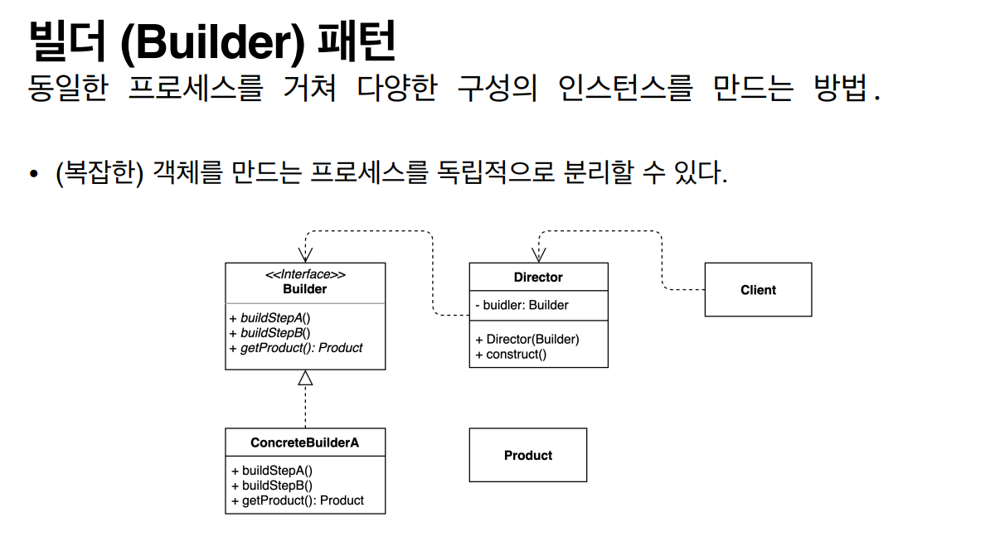

## 2021.11.27_빌더패턴01.패턴소개

## 빌더패턴

- 인스턴스 생성과 관련있음
- 그 인스턴스가 다양한 구성으로 만들어질 수 있고
  - 동일한 프로세스를 통해서 만들 수 있게해주는 패턴임

## App.java

```java
package me.whiteship.designpatterns._01_creational_patterns._04_builder._01_before;

import java.time.LocalDate;

public class App {

    public static void main(String[] args) {
        TourPlan tourPlan = new TourPlan();
        tourPlan.setTitle("칸쿤 여행");
        tourPlan.setNights(2);
        tourPlan.setDays(3);
        tourPlan.setStartDate(LocalDate.of(2020, 12, 9));
        tourPlan.setWhereToStay("리조트");
        tourPlan.addPlan(0, "체크인 이후 짐풀기");
        tourPlan.addPlan(0, "저녁 식사");
        tourPlan.addPlan(1, "조식 부페에서 식사");
        tourPlan.addPlan(1, "해변가 산책");
        tourPlan.addPlan(1, "점심은 수영장 근처 음식점에서 먹기");
        tourPlan.addPlan(1, "리조트 수영장에서 놀기");
        tourPlan.addPlan(1, "저녁은 BBQ 식당에서 스테이크");
        tourPlan.addPlan(2, "조식 부페에서 식사");
        tourPlan.addPlan(2, "체크아웃");q
    }
}

```

## 짧은 여행을 가는 경우

```java
package me.whiteship.designpatterns._01_creational_patterns._04_builder._01_before;

import java.time.LocalDate;

public class App {

    public static void main(String[] args) {
        //짧은 여행을 가는 경우 
        TourPlan shortTrip new = TourPlan();
        shortTrip.setTitle("오래곤 롱비치 여행");
        shortTrip.setStartDate(LocalDate.of(2021,7,15));
        
        //딥한 여행의 경우
        TourPlan tourPlan = new TourPlan();
        tourPlan.setTitle("칸쿤 여행");
        tourPlan.setNights(2);
        tourPlan.setDays(3);
        tourPlan.setStartDate(LocalDate.of(2020, 12, 9));
        tourPlan.setWhereToStay("리조트");
        tourPlan.addPlan(0, "체크인 이후 짐풀기");
        tourPlan.addPlan(0, "저녁 식사");
        tourPlan.addPlan(1, "조식 부페에서 식사");
        tourPlan.addPlan(1, "해변가 산책");
        tourPlan.addPlan(1, "점심은 수영장 근처 음식점에서 먹기");
        tourPlan.addPlan(1, "리조트 수영장에서 놀기");
        tourPlan.addPlan(1, "저녁은 BBQ 식당에서 스테이크");
        tourPlan.addPlan(2, "조식 부페에서 식사");
        tourPlan.addPlan(2, "체크아웃");q
    }
}

```

- 단점은 일괄된 프로세스가 없다는것
- Days와Nights는 같이 세팅되어야하는데 
  - 한개만 하는 경우가 없게 강제하기가 어렵다
  - Days쓰면 Nights를 쓰게 하는 것을 말함
- 생성자 생성시 
  - 너무 복잡해지게된다.

```java
package me.whiteship.designpatterns._01_creational_patterns._04_builder._01_before;

import java.time.LocalDate;
import java.util.List;

public class TourPlan {

    private String title;

    private int nights;

    private int days;

    private LocalDate startDate;

    private String whereToStay;

    private List<DetailPlan> plans;

    public TourPlan() {
    }

    public TourPlan(String title, int nights, int days, LocalDate startDate, String whereToStay, List<DetailPlan> plans) {
        this.title = title;
        this.nights = nights;
        this.days = days;
        this.startDate = startDate;
        this.whereToStay = whereToStay;
        this.plans = plans;
    }

    @Override
    public String toString() {
        return "TourPlan{" +
                "title='" + title + '\'' +
                ", nights=" + nights +
                ", days=" + days +
                ", startDate=" + startDate +
                ", whereToStay='" + whereToStay + '\'' +
                ", plans=" + plans +
                '}';
    }

    public String getTitle() {
        return title;
    }

    public void setTitle(String title) {
        this.title = title;
    }

    public int getNights() {
        return nights;
    }

    public void setNights(int nights) {
        this.nights = nights;
    }

    public int getDays() {
        return days;
    }

    public void setDays(int days) {
        this.days = days;
    }

    public LocalDate getStartDate() {
        return startDate;
    }

    public void setStartDate(LocalDate startDate) {
        this.startDate = startDate;
    }

    public String getWhereToStay() {
        return whereToStay;
    }

    public void setWhereToStay(String whereToStay) {
        this.whereToStay = whereToStay;
    }

    public List<DetailPlan> getPlans() {
        return plans;
    }

    public void setPlans(List<DetailPlan> plans) {
        this.plans = plans;
    }

    public void addPlan(int day, String plan) {
        this.plans.add(new DetailPlan(day, plan));
    }
}
```

- 원래 이렇게 있을때

## 짧은 여행을 위한 생성자

```java
    public TourPlan(String title, LocalDate startDate, String whereToStay, List<DetailPlan> plans) {
        this.title = title;
        this.startDate = startDate;
        this.whereToStay = whereToStay;
        this.plans = plans;
    }

    public TourPlan(String title, LocalDate startDate) {
        this.title = title;
        this.startDate = startDate;
    }
```

- 이렇게 하면 생성자가 많아짐
- 그렇게 되면 사용자 측에서 어떤 생성자를 써야하는지 헷갈림



- 빌더에 인스턴스 만드는 방법을 스텝별로 만들어 인터페이스로 정의하고

- 최종적으로 인스턴스를 받아올 수 있는 get product라는 인터페이스 만들고

  - 그리고 구현체를 만들것, 이구현체와 인터페이스 관계라서
  - 인터페이스 만드는 관계를 concreate로 해서 다양한 관계를 만들 수 있음

- Director로 해서 빌더 사용하면 반복되는 호출 스텝을 숨기고

  - 클라이언트는 Director를 인스턴스 프로덕트를 받아서 쓸 수 있음

  