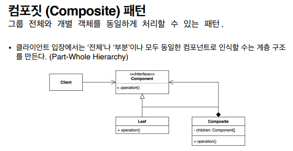

## 2021.12.09_컴포짓패턴01.패턴소개

- 컴포짓

  - 전체 계층구조와 그리고 그 계층구조를 구성하는 부분적인 객체를 클라이언트 입장에서 동일하게 생각할 수 있게
  - 전체인지 전체의 부분인지 , 하위 단에 있는 것인지(트리의 마지막 오브젝트인지) 상관없이 동일한 인터페이스로 사용하게 하는것
  - 트리 구조로 구성해야하는 제약 사항이 있음
    - 그래서 그렇게 많이 쓰이지 않을까 하지만, 일상에 트리 구조가 많음 디자인패턴이 아니라 자료구조에 트리구조 공부하는 이유는 다양하게 구성할 수있는것이 많고 소프트엔지니어에서도 많이 사용할 수 있음

  ## 소스 코드

  ``` java
  public class Client {
    public static void main(String[] args){
  		Item doranBlade = new Item("도란검", 450);
      Item healPotion = new Item("체력 물약", 50);
      
      Bag bag = new Bag();
      bag.add(doranBlade);
      bag.add(healPotion);
      
      Client client = new Client();
      client.printPrice(doranBlade);
      client.printPrice(bag);
    }
    private void printPrice(Item item){
  		System.out.println(item.getPrice());
    }
    
    private void printPrice(Bag bag){
      int sum =	bag.getItems().Stream().mapToInt(Item::getPrice).sum();
    	System.out.println(sum);
    }
  }
  ```

  - 이렇게 하면 클라이언트가 많은것을 알아야함
  - 객체지향적으로 옳은 것인지 고민이 되고 , 캐릭터가 아이템을 가지고 있는데 그것을 어떻게 디테일한것을 클라이언트가 알아야만 개수나 합을 알 수 있는 것인지 고민해야함

  

- 클라이언트는 컴포넌트의 공통 인터페이스 정의하고 인터페이스 타입만 클라이언트가 보면됨
- 캐릭터, 아이템, 백 이런것들은 저기서 Leaf, Composite 객체가 되고
  - Leaf는 기본적인 단위가 되고, 크리미티브한 타입
  - Composite은 여러개 컴포넌트를 배열 리스트로 가지고 있음 대신 리프 타입이 아니고 컴포넌트 타입이다.
  - 그룹을 표현할 수 있는 컴포짓 객체가 있음
  - 모든것은 지원이 되어야함 그래야 클라이언트 코드가 좋아질 수 있음