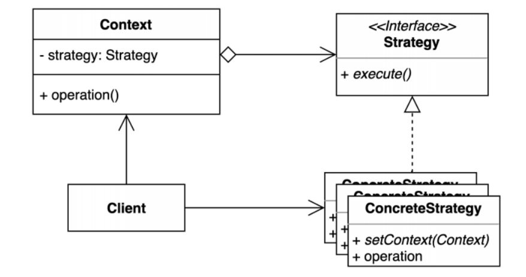

## 22.02.20_전략패턴-패턴소개

- 은연중에 많이쓰는 것 
- 프레임워크에서  많이 표현해서 씀
- 어떤 일을 수행하는 방법이 여러개일때, 그 여러 알고리즘 각 개별적인 클래스로 캡슐화하고
  - 그 캡슐화한것을 공통된 인터페이스로 추상화해서 로직을 수행하는 곳에서는 추상화된 인터페이스만 사용함으로써 코드는 바뀌지 않지만 사용하는 알고리즘을 바꿔서 끼어넣을 수 있게 하는 것
- 자바 개발자에게 제일 많이 보이는것 compareater 인터페이스 있는데
  - 이게 대표적인 전략 패턴, 우리가 그 인터페이스의 구현체를 제공해 주는것이 concreate 전략을 만들어주는과정으로 볼 수 있음

### 01.소스코드

- **Client**

  ```java
  public class Client{
      
      public static void main(String[] args){
          BlueLightRedLight blueLightRedLight = new BlueLightRedLight(1);
          blueLightRedLight.blueLight();
          blueLightRedLight.redLight();
      }
  }
  ```

- **BlueLightRedLight**

  ```java
  public calss BlueLightRedLight{
      
      private int speed;
      
      public BlueLightRedLight(int speed){
          this.speed = speed;
      }
      
      public void blueLight(){
          if(speed==1){
  			System.out.println("무 궁 화    꽃    이");
          }else if(speed == 2)
          {
           	System.out.println("무궁화꽃이");
          }else
          {
           	System.out.println("무광꼬치");
          }
      }
      
    	public void redLight(){
          if(speed==1){
          	System.out.println("피 었 습 니  다.");
          }else if(speed==2){
          	System.out.println("피었습니다.");
          }else
          {
           	System.out.println("폈슴돠");
          }
      }
  }
  ```

  

- 위에 처럼 속도를 달리할 수 있는 기능이 있다고 가정할 때
- 이렇게 코드를 작성하는 경우가 있다 if else를 이용해서 분기하는것
- 위와 같은 것을 전략패턴을 이용하여 기존 코드를 건들이지 않고 할 수 있음



- Context는 원래 사용하던거 였는데 상황에 따라 달라지는 전략을 staregy 인터페이스로 뽑아내는것
- 중요한것은 인터페이스로 빼야함
  - 그래야 상호 교환 가능한 여러가지 전략을 바꿔서 껴넣을 수 있음
- ConcreateStrategy
  - Strategy의 구현체이고 각각의 알고리즘을 해당 스트레트지 내에서 구현한 것
  - 클라이언트 직접 사용한 strategy를 선택해서 Context를 만들때 
    - Context의 어떤 operation을 적용할 때 넣어 줄 수 있음
  - 즉, 생성자에 넣어줄수 있고, 특정한 operation을 실행할 때 넣어줄 수 있음
- 여기서 context는 blueLight, redLight에 해당
- 각각의 빠르기가 전략에 해당