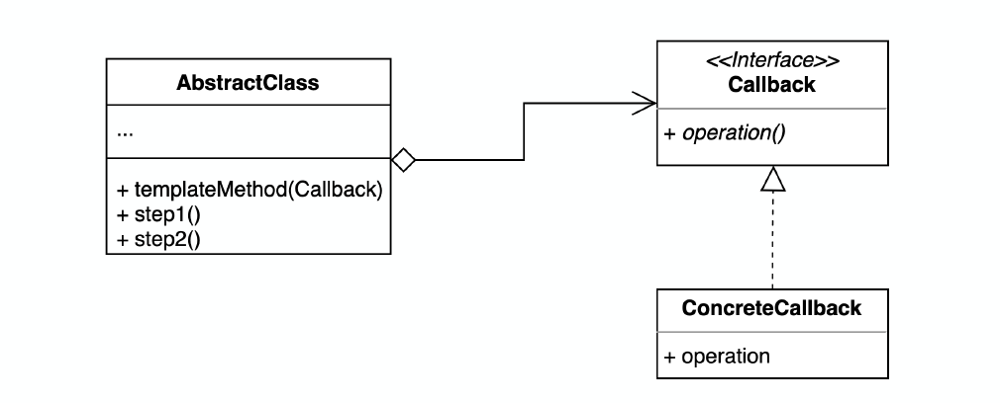

## 22.03.02_템플릿메소드_패턴적용하기

## 01.템플릿메소드패턴

- 비슷한 코드인데 조금 몇라인 3-4줄 정도가 다를때 적용하기 좋은 패턴

### 01.1 Template.java

```java
import java.io.BufferedReader;
import java.io.FileReader;
import java.io.IOException;

public abstract class FileProcessor{
  private String path;
  public FileProcessor(String path){
    this.path = path;
  }
  
  public int process(){
    try(BufferedReader reader = new BufferedReader(new FileReader(path))){
      int result = 0;
      String line = null;
      while((line = reader.readLine()) != null){
        result = getResult(result,line);// result = getResult(result, Integer.parseInt(line));
      }
      return result;
    }catch(IOException e){
      throw new IllefalArgumentException(path + "에 해당하는 파일이 없습니다.",e);
    }
    protected abstract getResult(int result, String line);// protected abstract getResult(int result, int number);
  }
}
```

### 01.2 Plus.java

```java
public class Plus extends FileProcessor{
  public Plus(String path){
    super(path);
  }
  @Override
  protected int getResult(int result, String line){//protected int getResult(int result, int number){
    return result += Integer.parseInt(line);
  }
}
```

### 01.3 Client.java | Plus사용

```java
public clas Client{
  public static void main(String[] args){
    FileProcessor fileProcessor = new Plus("number.txt");
    int result = fileProcessor.process();
    System.out.println(result);
  }
}
```

### 01.4 곱셈을 추가하는 경우

```java
public class Multiple extends FileProcessor{
  public Multiple(String path){
    super(path);
  }
  @Override
  protected int getResult(int result, String line){//protected int getResult(int result, int number){
    return result *= Integer.parseInt(line);
  }
}


//Client
    FileProcessor fileProcessor = new Multiple("number.txt");
```

- 여기까지는 템플릿 메소드 패턴

## 02. 템플릿과 유사하지만 다른 템플릿 콜백 패턴



- 콜백으로 상속 대신 위임을 사용하는 템플릿 패턴
  - 상속 대신 익명 내부 클래스 또는 람다 표현식을 활용할 수 있음

- operation을 콜백에 담음 
  - 전략패턴과 비슷하다고 할 수 있지만 여러개의 메소드를 가지고 있을 수 있는 차이
- 콜백은 하나의 메소드만 담고 있어야함
  - 그래서 여러개의 메소드가 필요하면 그만큼의 인터페이스가 있어야함
  - 여기서는 상속을 사용안해도 된다는 점이 좋다고 함
  - ConcreateCallback를 구현체로 만드는 방법과 익명내부 클래스 , 자바8에 도입된 람다 익스프레션을 사용할 수 있음

### 02.1 콜백역할하는 Operator

```java
public interface Operator{
  abstract int getResult(int result, int number);
}
```

### 02.2 템플릿 부분

```java
import java.io.BufferedReader;
import java.io.FileReader;
import java.io.IOException;

public class FileProcessor{
  private String path;
  public FileProcessor(String path){
    this.path = path;
  }
  
  public int process(Operator operator){
    try(BufferedReader reader = new BufferedReader(new FileReader(path))){
      int result = 0;
      String line = null;
      while((line = reader.readLine()) != null){
        result = operator.getResult(result,line);// result = getResult(result, Integer.parseInt(line));
      }
      return result;
    }catch(IOException e){
      throw new IllefalArgumentException(path + "에 해당하는 파일이 없습니다.",e);
    }
  }
}
```

- 이렇게 해주면됨 상속이 필요없기 때문에
- 이렇게 하면 multiple과 plus가없어짐

### 02.3 Client부분 | 사용법

```java
public clas Client{
  public static void main(String[] args){
    FileProcessor fileProcessor = new FileProcessor("number.txt");
    int result = fileProcessor.process(new Operator(){
      @Override
      public int getResult(int result, int number){
        reutrn result += number;
      }
    });//익명내부 클래스

    int result1 = fileProcessor.process((result1,number)->result +=number);//람다식으로 표현
    System.out.println(result);
  }
}
```

- 이렇게 해서 사용할 수도 있음

- 클래스도 줄어들고 위임을 함으로써 언제든지 원하는 형태로 바꿔서 쓸 수 있음

- 다른 곳에서 쓰게 되면 이것을 클래스로 만들어서 사용도됨

  ```java
  public class Plus implement Operator{
    @Override
    public int getResult(int result, int number){
      return result += number;
    }
  }
  
  //Client부분
   FileProcessor fileProcessor = new FileProcessor("number.txt");
      int result = fileProcessor.process(new Plus());//이렇게 해도됨
  ```

  
