## 2021.11.17_15.인공지능서비스모델검증하기

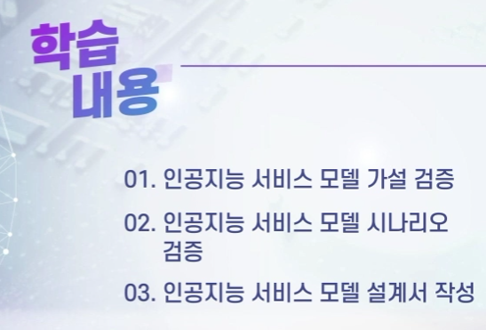

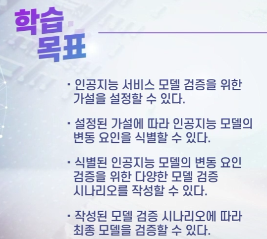

## 01.인공지능 서비스 모델 가설 검증

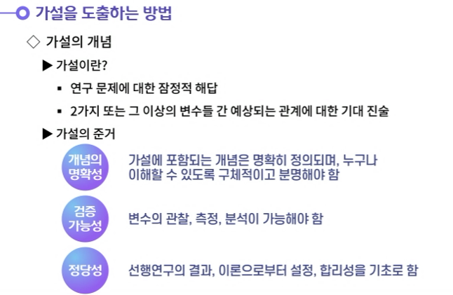

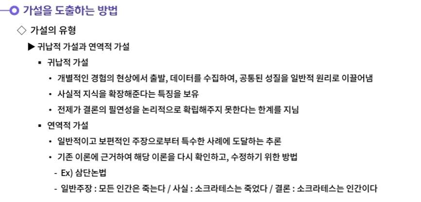

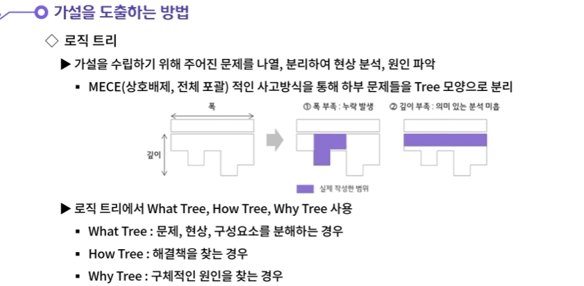

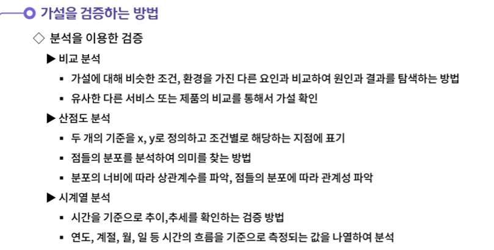

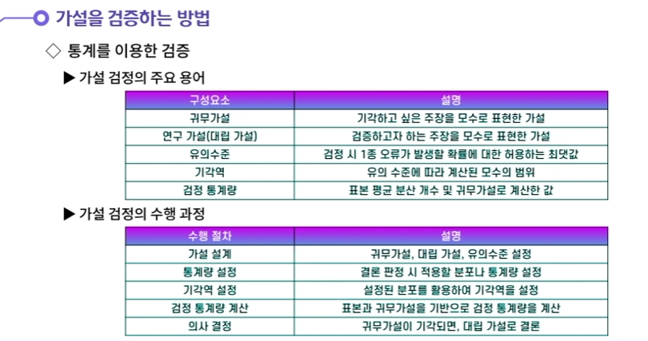

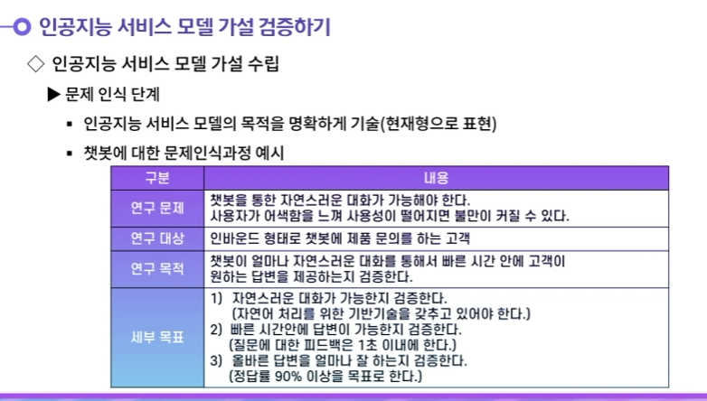

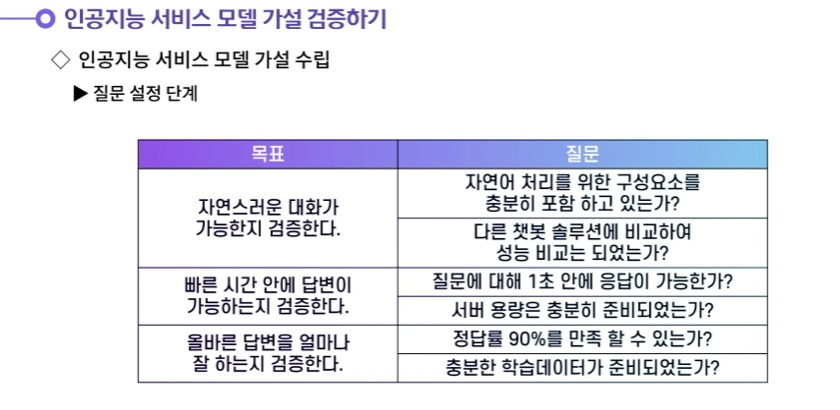

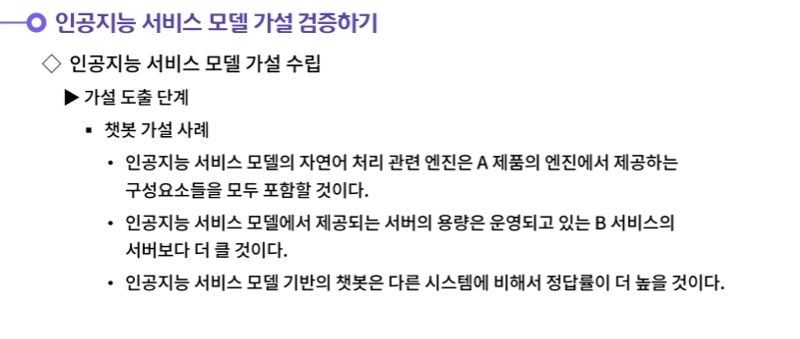

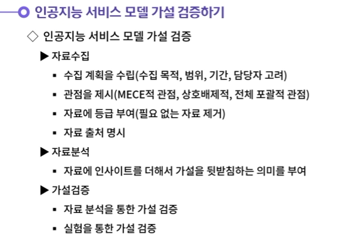

## 02. 인공지능 서비스 모델 시나리오 검증

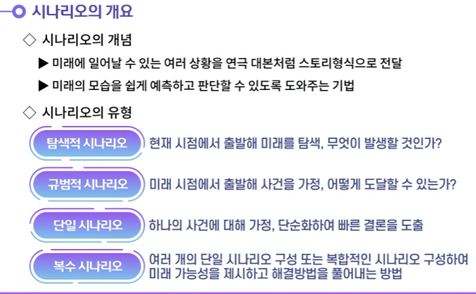

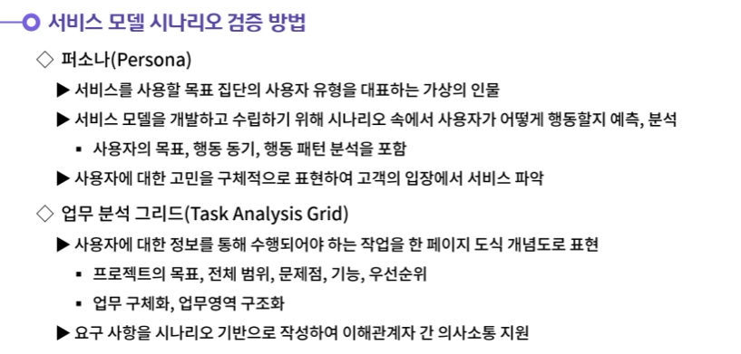

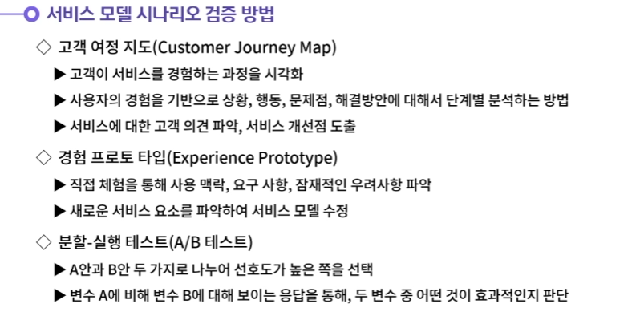

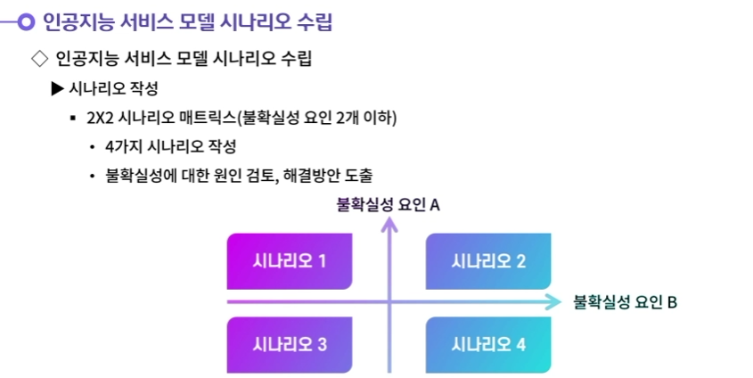

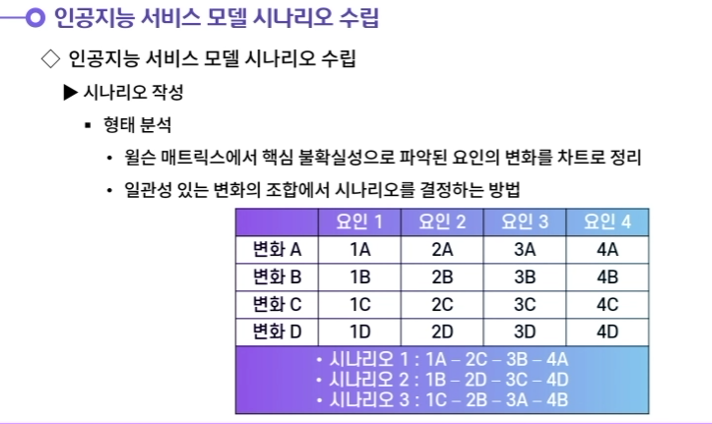

## 03. 인공지능 서비스 모델 설계서 작성

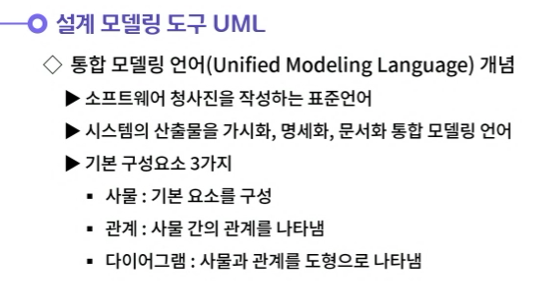

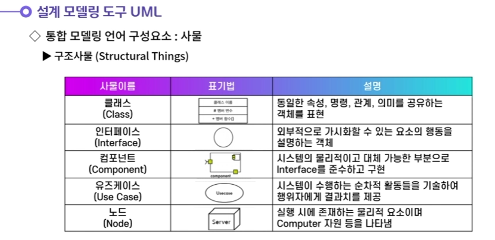

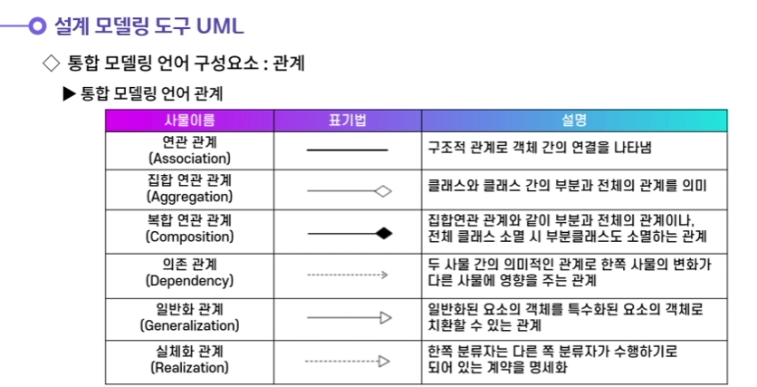

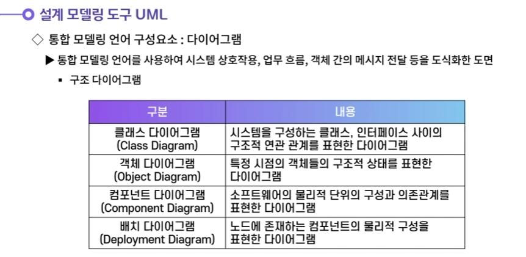

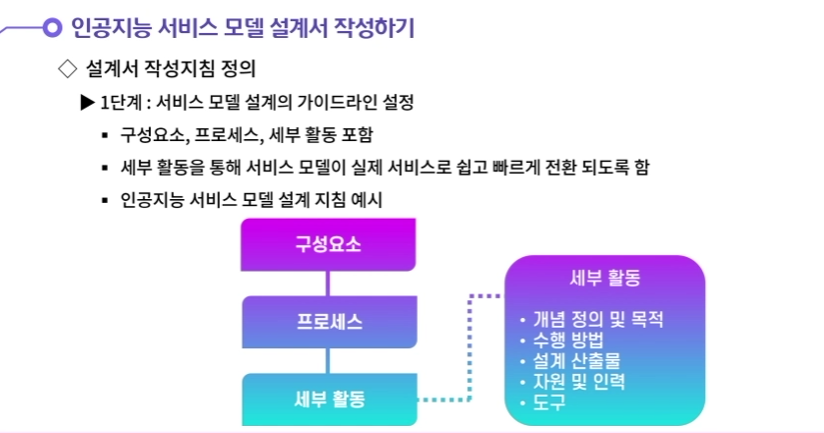

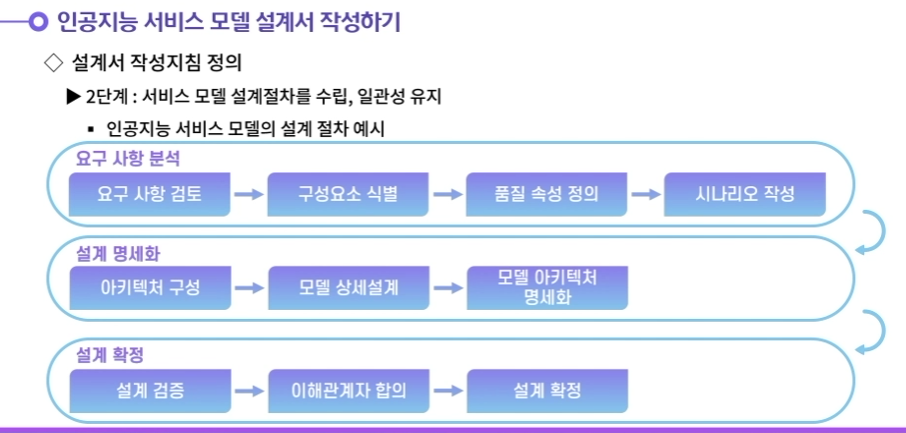

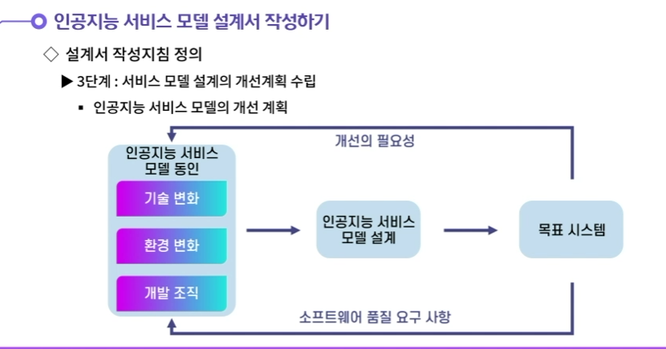

- **시나리오에는 다음과 같은 4가지 유형이 존재한다.**
  **첫번째는 탐색적 시나리오이다. 탐색적 시나리오는 현재의 시점에서 출발하여 “무엇이 발생할 것인가?” 라는 질문에 해답을 구한다. 불확실성을 토대로 다양한 미래의 모습을 탐색하는 방법이다.**
  **두번째는 규범적 시나리오이다. 규범적 시나리오는 미래의 한 시점에서 출발하여 “어떻게 도달할 수 있는가? ”라는 질문에 해답을 구한다. 미래의 특정 사건을 가정한 다음 해당 사건을 발생시킬 수 있는 요인을 따져 보는 방법이다.**
  **세번째는 단일 시나리오이다. 단일 시나리오는 하나의 사건에 대해 가정하고 단순화하여 빠른 결론을 도출하기 위한 방법이다.**
  **네번째는 복수 시나리오이다. 복수 시나리오는 여러 개의 단일 시나리오 또는 복합적인 시나리오를 구성하여 다양한 미래 가능성을 제시하고 해결방법을 풀어내는 방법이다. 일반적으로는 복수 시나리오를 사용하여 분석하게 된다.**

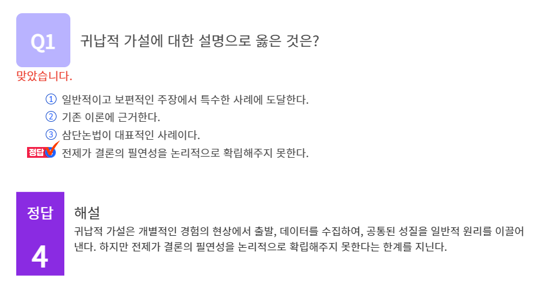

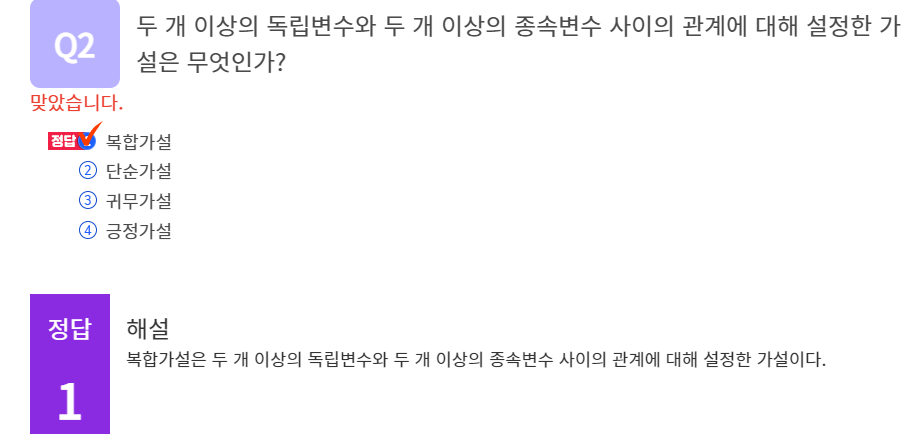

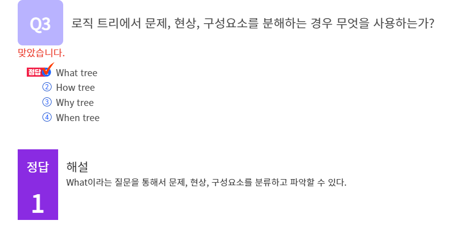

#### 1. 시나리오의 유형에 대해 생각해봅시다.

1. 시나리오에는 다음과 같은 4가지 유형이 존재한다.
   첫번째는 탐색적 시나리오이다. 탐색적 시나리오는 현재의 시점에서 출발하여 “무엇이 발생할 것인가?” 라는 질문에 해답을 구한다. 불확실성을 토대로 다양한 미래의 모습을 탐색하는 방법이다.
   두번째는 규범적 시나리오이다. 규범적 시나리오는 미래의 한 시점에서 출발하여 “어떻게 도달할 수 있는가? ”라는 질문에 해답을 구한다. 미래의 특정 사건을 가정한 다음 해당 사건을 발생시킬 수 있는 요인을 따져 보는 방법이다.
   세번째는 단일 시나리오이다. 단일 시나리오는 하나의 사건에 대해 가정하고 단순화하여 빠른 결론을 도출하기 위한 방법이다.
   네번째는 복수 시나리오이다. 복수 시나리오는 여러 개의 단일 시나리오 또는 복합적인 시나리오를 구성하여 다양한 미래 가능성을 제시하고 해결방법을 풀어내는 방법이다. 일반적으로는 복수 시나리오를 사용하여 분석하게 된다.